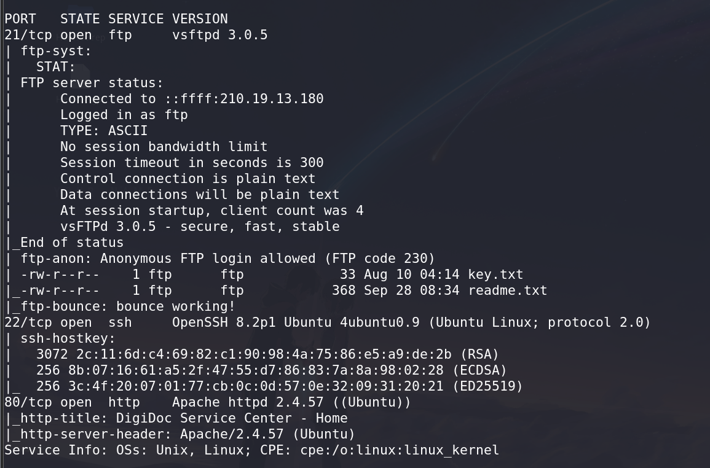

# DigiDoc - CTF Challenge Writeup

## Challenge Information 
- **Name**: DigiDoc
- **Objective**: The objective of the "DigiDoc" CTF challenge is to gain root access to the target server by exploiting various vulnerabilities, including FTP, web application vulnerabilities (such as upload and IDOR), and privilege escalation. 

## Solution
To successfully tackle the "DigiDoc" challenge, I executed the following steps:

1. **Initial Enumeration using Nmap**:
   - I started by performing an initial scan using Nmap on the provided IP address, which revealed open ports: FTP, SSH, and HTTP.

        

2. **FTP Analysis**:
   - Investigating the FTP service, I logged in anonymously and found two files. Downloading these files revealed an ECB key that would be useful later.

        

        

        

3. **Exploring the HTTP Service**:
   - Moving to the HTTP service, I ran a directory brute force using Gobuster. Eventually, it identified a login page.

        

        

   - Logging in as a guest revealed an upload page, indicating a potential upload vulnerability. However, admin access was required.

        

        

4. **Identifying IDOR Vulnerability**:
   - Analyzing the accounts tab, I identified an Insecure Direct Object Reference (IDOR) vulnerability, allowing access to user IDs, crucial for admin privileges.
   - IDOR vulnerability involves manipulating user IDs or object references to gain unauthorized access.

        

5. **Exploiting Upload Vulnerability**:
   - I attempted exploiting the upload vulnerability. Despite correctly written code and magic bytes, standard PHP file extensions didn't work.
   - Following recommendations from hacktricks, I discovered that the `.phtml` extension allowed successful uploads, enabling me to upload a reverse shell.

        

        

        

6. **Escalating Privileges**:
   - Accessing the server, I realized I was the `www-data` user. To achieve root access, I explored the home directory, finding two users: Alvin and Dave.

        

   - Decoding a base64-encoded string in Alvin's directory, using the previously obtained ECB key, revealed a plaintext password.

        

        

7. **Privilege Escalation**:
   - SSHing into the server using Alvin's credentials, I discovered an ability for Alvin to execute a hidden Python script as root using sudo.

        

8. **Privilege Escalation**:
   - The solution involved hijacking the libraries in a script file provided without modifying it.
   - Creating a new `shutil.py` file, spawning a shell using `os`, escalated privileges to root.

        

9. **Flag Retrieval**:
   - The obtained flag through the intended solution: `ABOH23{wh47_4_cr4pp7_s3rv1c3_c3nt3r}`.

        

The resolution of the "DigiDoc" challenge encompassed identifying multiple vulnerabilities, including FTP access, web application flaws, and privilege escalation, ultimately leading to obtaining the root flag.

## Flag
The flag for this challenge is: `ABOH23{wh47_4_cr4pp7_s3rv1c3_c3nt3r}`.

This writeup demonstrates the process of identifying and exploiting various vulnerabilities to gain root access in the "DigiDoc" CTF challenge. For any further inquiries or clarifications, please feel free to ask.
