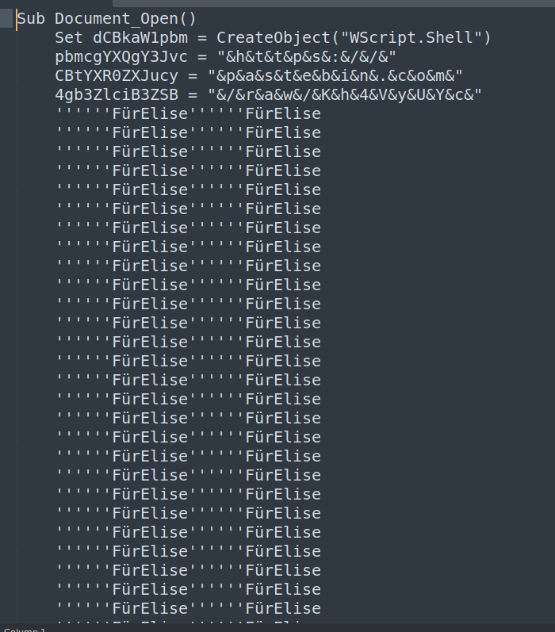
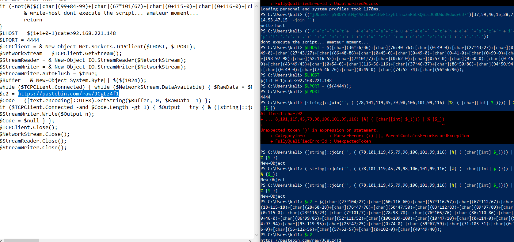

# FurElise - CTF Challenge Writeup

## Challenge Information
- **Name**: FurElise
- **Objective**: The objective of the "FurElise" CTF challenge is to decode a hidden flag concealed within a PowerShell script by following a series of deobfuscation and decoding steps.

## Solution
To solve the "FurElise" challenge and retrieve the flag, I executed the following steps:

1. **File Analysis**:
   - Upon inspecting the provided file, it was evident that it is a PowerShell script containing obfuscated code.

        

2. **Deobfuscation**:
   - Drawing inspiration from problem-solving approaches by John Hammond, I initiated the deobfuscation process.
   - The initial step involved removing the `&` present throughout the script.

        

3. **Removing Unnecessary Lines**:
   - Further simplification of the script was performed by eliminating redundant lines, notably lines containing `''''''FürElise''''''FürElise`.
   - This step helped in revealing clearer, relevant content within the script.

        

4. **Identifying Clues**:
   - Within the revised script, two links were discovered, which contained crucial elements of the flag.
   - The first link provided the initial part of the flag.

        

5. **Analyzing the Second Link**:
   - The second link presented another PowerShell script. However, caution was exercised against executing it directly on a host machine due to safety concerns.

        

6. **Decoding Base64**:
   - The second PowerShell script was decoded from Base64, revealing additional script content.
   - To understand its functionality, portions of the script were cautiously executed one by one, avoiding potential risks and aiming to decode it progressively.

        

        

7. **Locating Hidden Information**:
   - While decoding the PowerShell script, a link was discovered halfway through the process, leading to the final part of the flag.

        

8. **Final Flag Retrieval**:
   - Navigating to the obtained link revealed the last segment of the flag, completing the puzzle.

        

The resolution of the "FurElise" challenge involved systematic deobfuscation, cautious decoding, and progressive script execution to unveil hidden elements and retrieve the flag.

## Flag
The flag for this challenge is: `ABOH23{d!ff1cU17_s0Ng_FROm_hEaRtBrE4K}`.

This writeup serves as a demonstration of decoding techniques used to extract the hidden flag within the "FurElise" CTF challenge. Should you require further explanation or have additional queries, please feel free to ask.
