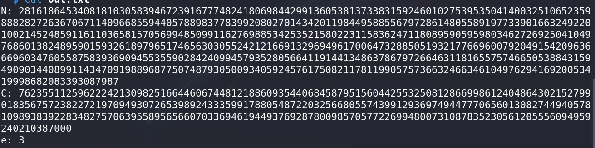
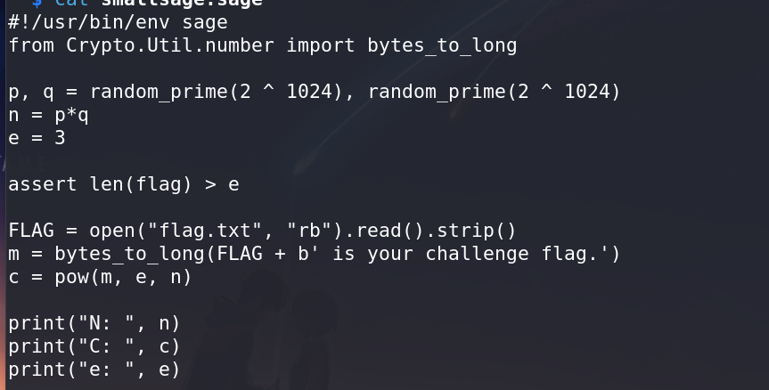
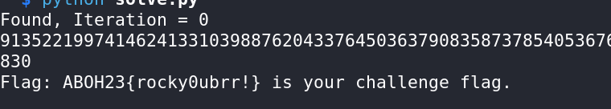

# Small Sage - CTF Challenge Writeup

## Challenge Information
- **Name**: Small Sage  
- **Objective**: The objective of the "Small Sage" CTF challenge is to decipher a flag that has been encrypted using RSA encryption techniques, focusing on elements like `n`, `p`, `q`, `C`, `N`, and `e`.

## Solution
To successfully solve the "Small Sage" challenge and retrieve the flag, I followed these steps:

1. **Initial Analysis**:
   - Upon inspecting the provided "Small Sage" script, it was evident that it resembled RSA encryption, as it contained elements like `n`, `p`, and `q`.
   - Additionally, the `out.txt` file contained variables `C`, `N`, and `e`, further indicating an RSA encryption problem.


        

        

2. **Identifying RSA Encryption**:
   - Recognizing the RSA encryption components (`n`, `p`, `q`, `C`, `N`, `e`), it was clear that this challenge was centered around RSA encryption and decryption.

3. **Approach**:
   - Noticing the hint with the term "small" in the challenge name, I hypothesized that it might involve a small `e` problem in RSA encryption.
   - I proceeded to use my typucal script tailored for solving RSA problems with small `e` values.
   - You can find the script in solve.py

4. **Flag Retrieval**:
   - Executing the script designed to handle RSA problems with small `e` values successfully decrypted the encrypted data.
   - The deciphered message revealed the flag: `ABOH23{rocky0ubrr!}`.


        


        ```python
        import gmpy2

        N = 28161864534081810305839467239167774824180698442991360538137338315924601027539535041400325106523598882827263670671140966855944057889837783992080270143420119844958855679728614805589197733901663249220100214524859116110365815705699485099116276988534253521580223115836247118089590595980346272692504104976860138248959015932618979651746563030552421216691329694961700647328850519321776696007920491542096366696034760558758393690945535590284240994579352805664119144134863786797266463118165575746650538843159490903440899114347091988968775074879305009340592457617508211781199057573663246634610497629416920053419998682083393087987
        e = 3
        C = 762355112596222421309825166446067448121886093544068458795156044255325081286699861240486430215279901835675723822721970949307265398924333599178805487220325668055743991293697494477706560130827449405781098938392283482757063955895656607033694619449376928780098570577226994800731087835230561205556094959240210387000

        for t in range(10):
            m, is_true_root = gmpy2.iroot(t * N + C, e)
            if is_true_root:
                print(f"Found, Iteration = {t}")
                print(m)
                print(f"Flag: {bytearray.fromhex(format(m, 'x')).decode()}")
                break
        ```

The resolution of the "Small Sage" challenge involved recognizing RSA encryption elements and leveraging a specialized script to handle the small `e` problem, resulting in the decryption of the encrypted data to obtain the flag.

## Flag
The flag for this challenge is: `ABOH23{rocky0ubrr!}`.

This writeup demonstrates the process of identifying and decrypting an RSA-encrypted flag in the "Small Sage" CTF challenge. Should you require further clarification or have additional questions, please feel free to ask.
