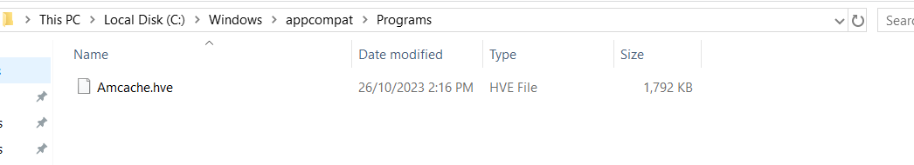
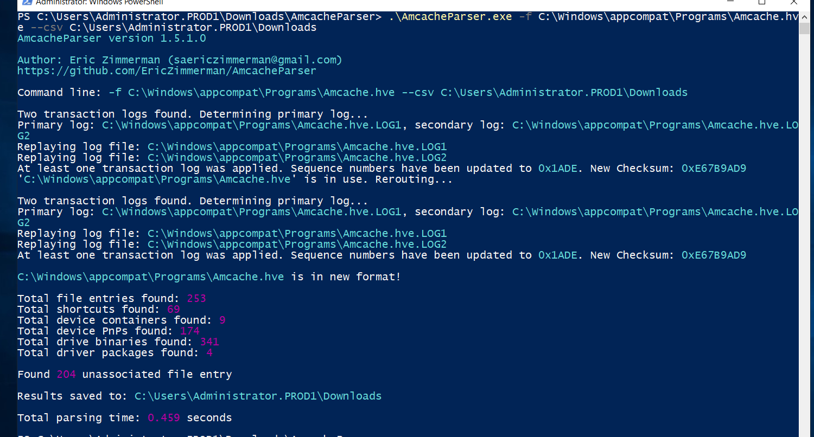
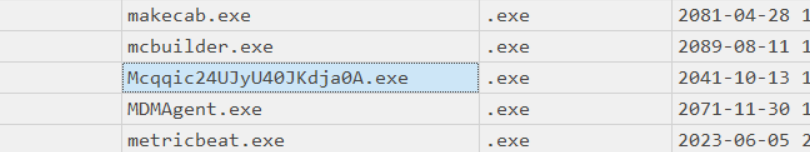

# Threat Hunting: Challenge 1 - CTF Challenge Writeup

## Challenge Information
- **Name**: Threat Hunting: Challenge 1
- **Objective**: The objective of the "Threat Hunting: Challenge 1" CTF challenge is to investigate a ransomware-like attack scenario within a provided VM and identify the executable responsible for the encryption.

## Solution
To successfully complete the "Threat Hunting: Challenge 1" challenge, I followed these steps:

1. **Challenge Context**:
   - This challenge is part of a series in the threat hunting category and involves a provided VM named BOH_TH_2023. The VM needs to be extracted and loaded onto a virtualization platform like VMware or Oracle VirtualBox.
   - It is recommended to solve this challenge before looking into Challenge 2 and Challenge 3
   - However, you can solve Challenge 2 and Challenge 3 in any order

2. **Initial VM Inspection**:
   - Upon loading the VM, it became apparent that the files were encrypted, resembling a ransomware attack scenario. The challenge also directed us to identify the executable responsible for the encryption. 
   - Therefore, it is safe to assumed that the ransomware executable has already been executed. 

      

3. **Utilizing Amcache and Shimcache**:
   - Amcache and Shimcache are artifacts used in Windows systems to record executed executables. 
   - Amcache is a registry hive that records metadata and information about applications and programs executed on a Windows system. It provides a wealth of information about executed executables.
     - Amcache is typically located in `C:\Windows\appcompat\Programs\Amcache.hve`.
   - Shimcache, another Windows artifact, also records information about executed programs but in a different format. However, in this challenge, the Shimcache files are intentionally corrupted.

      

4. **Amcache Parsing**:
   - To extract and process Amcache data, I utilized the AmcacheParser tool available at [Eric Zimmerman's website](https://ericzimmerman.github.io/#!index.md).
   - The Amcache data is typically stored in `C:\Windows\appcompat\Programs\Amcache.hve`. I searched for this file and utilized AmcacheParser to process it.

5. **Processing Amcache Data**:
   - Running AmcacheParser generated multiple CSV files, which I exported for easier analysis. These files can be explored using applications like Timeline Explorer or by downloading them from [Eric Zimmerman's website](https://ericzimmerman.github.io/#!index.md).

      

6. **Finding Suspicious Activity**:
   - By examining the generated CSV files, I eventually identified something suspicious among the data, indicating the executable responsible for the encryption.

      

7. **Flag Discovery**:
   - The identified executable responsible for the encryption is: `ABOH{Mcqqic24UJyU40JKdja0A.exe}`.

The resolution of the "Threat Hunting: Challenge 1" involved extracting Amcache data from the provided VM, utilizing AmcacheParser to process the data, and investigating the executables to identify the suspicious file responsible for the encryption.

## Flag
The flag for this challenge is: `ABOH{Mcqqic24UJyU40JKdja0A.exe}`.

This writeup demonstrates the process of investigating a ransomware-like attack scenario using Amcache parsing techniques in the "Threat Hunting: Challenge 1" CTF challenge. For further queries or clarifications, feel free to inquire.
