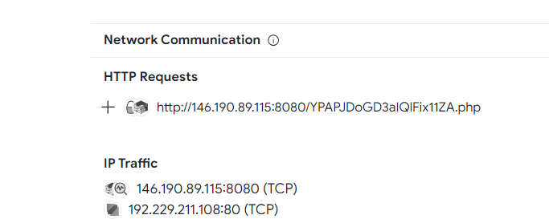

# Threat Hunting: Challenge 3 - CTF Challenge Writeup

## Challenge Information
- **Name**: Threat Hunting: Challenge 3
- **Objective**: The objective of the "Threat Hunting: Challenge 3" CTF challenge is to identify the significant indicator related to a potentially malicious executable based on its behavior observed through external connections.

## Solution
To successfully solve the "Threat Hunting: Challenge 3" challenge, I proceeded with the following steps:

1. **Context from Previous Challenge**:
   - Continuing from the previous challenge, I conducted further analysis on the executables by uploading them to security analysis platforms like VirusTotal and HybridAnalysis for comprehensive analysis.
   - It is recommended to solve Challenge 1 before looking into Challenge 3 and Challenge 3
   - However, you can solve Challenge 3 and Challenge 3 in any order

2. **Analysis Results**:
   - Upon reviewing the analysis results from the previous challenge (VirusTotal and HybridAnalysis), I observed that both executables made external connections to IP addresses. However, one particular connection stood out among the rest.

    

    

3. **Flag Identification**:
   - After careful observation and analysis, I identified the standout indicator related to a potentially malicious executable, which is the URL or IP address:
     - `ABOH{http://146.190.89.115:8080/YPAPJDoGD3aIQlFix11ZA.php}`.

The resolution of the "Threat Hunting: Challenge 3" involved analyzing the behavior of potentially malicious executables and identifying the significant external connection, aiding in the discovery of the flag.

## Flag
The flag for this challenge is: `ABOH{http://146.190.89.115:8080/YPAPJDoGD3aIQlFix11ZA.php}`.

This writeup demonstrates the process of analyzing executable behavior to identify significant indicators of potential malicious activity in the "Threat Hunting: Challenge 3" CTF challenge. For any further queries or clarifications, please feel free to inquire.
