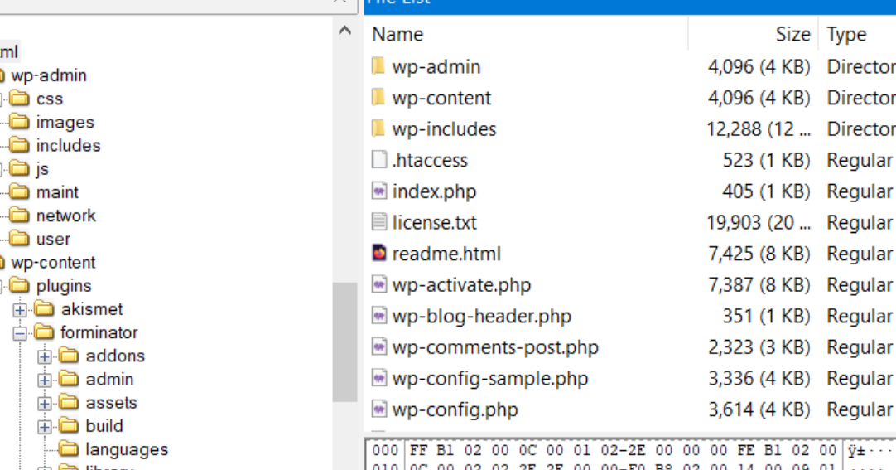
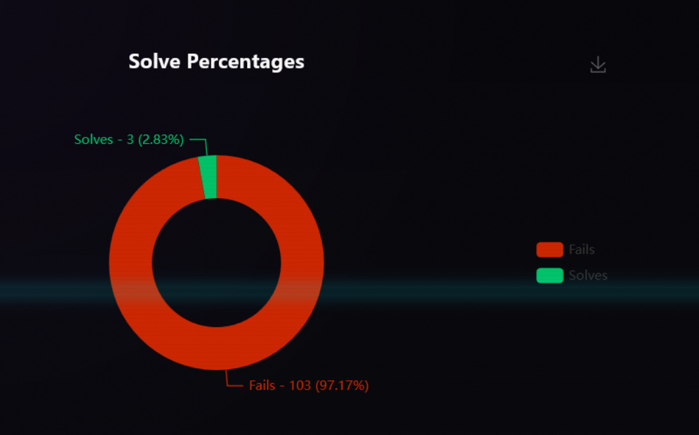

# 1 Initial Vector - CTF Challenge Writeup

## Challenge Information
- **Name**: Initial Vector  
- **Points**: 10  
- **Category**: Forensic  
- **Objective**: Investigate a compromised WordPress server, identify the attack vector, and determine which file was uploaded by the attacker using forensic analysis of the web server structure and logs.

---

## Solution

### 1. **Initial Clue: WordPress Server**
- From the description and directory structure, it’s clear we’re dealing with a **web server**.
- Navigated to the common web root: `/var/www/html` and identified a **WordPress installation**.

    

---

### 2. **Focusing on Plugins**
- WordPress plugins are often vulnerable, so the next step was to **enumerate installed plugins**.
- There were only **four plugins**, making enumeration quick and focused.

    

---

### 3. **Identifying a Known Vulnerability**
- Only one plugin — **Forminator** — returned positive results for vulnerabilities.
- Reference: [Patchstack CVE](https://patchstack.com/database/wordpress/plugin/forminator/vulnerability/wordpress-forminator-plugin-1-24-6-unauthenticated-arbitrary-file-upload-vulnerability)  
- Version **1.24.6** of Forminator is affected by **CVE-2023-4596**, which allows **unauthenticated arbitrary file uploads**.

    

---

### 4. **Understanding the Exploit**
- Found a public Proof-of-Concept exploit script: [GitHub PoC](https://github.com/E1A/CVE-2023-4596/blob/main/exploit.py)
- The script uploads a malicious file via a `POST` request to `wp-admin/admin-ajax.php`, then attempts to access it under the `wp-content/uploads/YYYY/MM/` path.
- Access logs on the server reflected a **similar pattern** of exploitation.

---

### 5. **Hunting for the Uploaded File**
- The hardest part of this challenge is the md5 hash as I didn't know the format of the md5 hash, but we will go into it later. 
- So after understanding the CVE, it is clear that after a POST request to wp-admin/admin-ajax.php, the script will go on to visit the uploads/2025/month folder for the things they uploaded.
- At first I didn't really understand the attack, and just submitted the md5 hash of all the files directly under wp-admin/admin-ajax.php but most of what im submitting, at this point, is 192.168.x.x local addresses, which makes it useless as it is already stated that an attacker attacked them, no way the attacker is from local.
- So I started to pivot to look at other IP addresses. And I submitted random files as i go along, until i found a sus file, which is an image disguised php.

    

- So i also submitted the md5 hash of the above mentioned file. But it didnt work.

    

---

### 6. **Final Struggle**
- I eventually gave up and just got the md5 of every file in the uploads folder and upload, and still fail. Which resulted in the following beautiful statistics.

    

---

### 7. **Flag**
- I then changed my approach and submitted the lowercase md5 hash of the file and got the flag 💀

---

## Flag
The flag for this challenge is:  
`prelim{CVE-2023-4596_6abb43dc87e07140ba94beafda03baad}`

---

## Summary
"Initial Vector" was a forensic challenge centered on real-world web exploitation techniques. By identifying a known plugin vulnerability, analyzing server logs, and tracking uploaded payloads, players practiced both offensive understanding and defensive forensics. The final hurdle was simple yet sneaky — the **formatting of the MD5 hash** — a subtle but effective way to test attention to detail.

---
