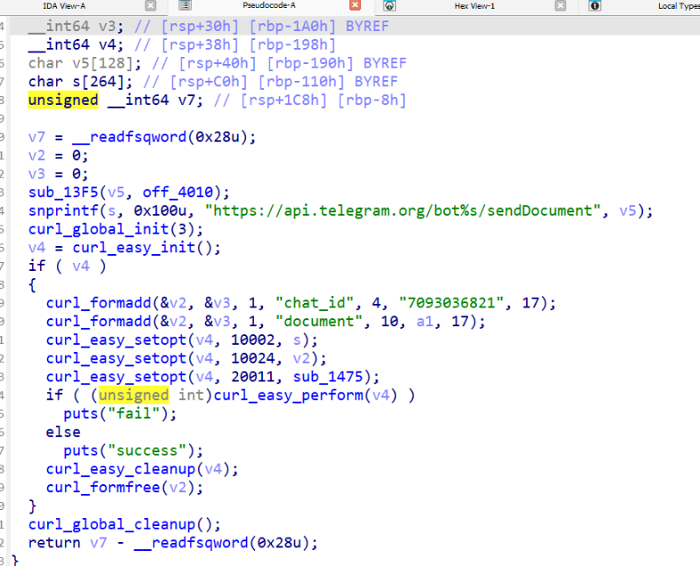
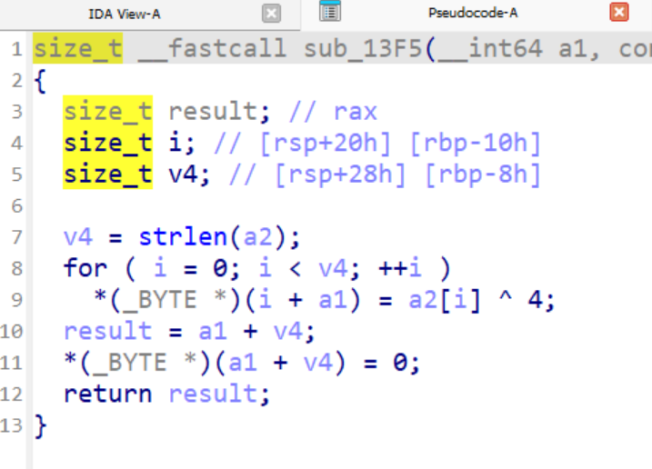
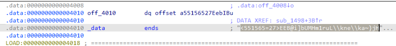
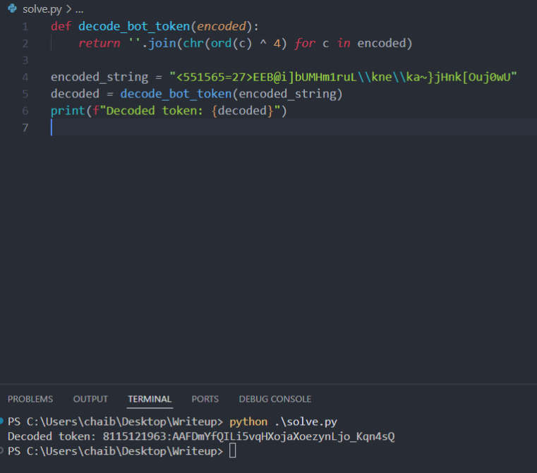
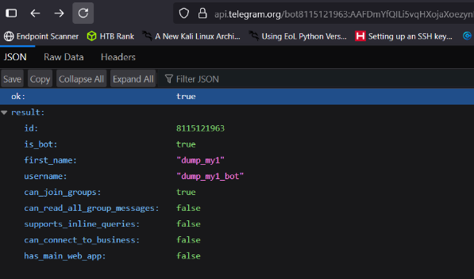
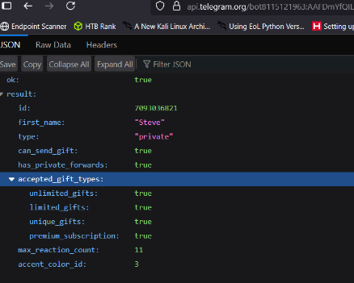
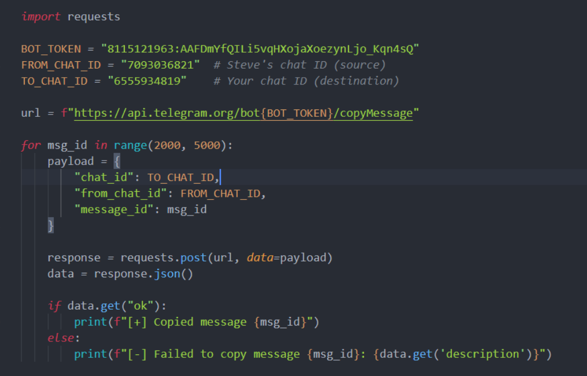
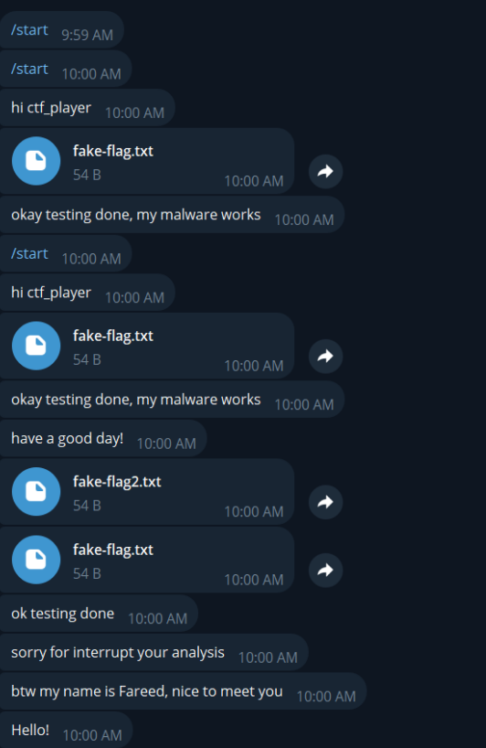
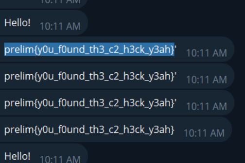

# 3 C2 - CTF Challenge Writeup

## Challenge Information
- **Name**: C2  
- **Points**: 10  
- **Category**: Forensic  
- **Objective**: Analyze a suspected command-and-control (C2) component discovered in a previously compromised system. Reverse engineer the binary to identify communication mechanisms, retrieve the bot token, and understand or replicate the exfiltration process.

---

## Solution

### 1. **Starting Point: telexfil**
- From the previous challenge, we already identified a suspicious binary named `telexfil`, likely short for **Telegram Exfiltration**.
- This is the logical starting point for analyzing the C2 mechanism.

---

### 2. **Reverse Engineering the Binary**
- Disassembling or reverse engineering `telexfil` revealed:
  - Usage of the **Telegram Bot API**
  - A hardcoded **chat ID**
  - However, the **bot token** was not directly visible.


    

---

### 3. **Locating the Encrypted Token**
- Tracing the logic further, we identified:
  - A function responsible for transforming/decrypting the token.
  - The **encrypted bot token** was hardcoded within the binary.
- Wrote a custom **decryption script** to recover the bot token.


    


    


    

---

### 4. **Reconstructing the Telegram API Calls**
- With the decrypted bot token, we now had access to multiple Telegram Bot API endpoints:
  - **Get bot info**:  
    ```text
    https://api.telegram.org/bot<TOKEN>/getMe
    ```

    

  - **Get chat details (description, etc.)**:  
    ```text
    https://api.telegram.org/bot<TOKEN>/getChat?chat_id=<CHAT_ID>
    ```

    

---

### 5. **Interacting with the C2 Bot**
- Another fun thing that you can do is to exfiltrate someone else’s chat, assuming that the bot has permission. 
- You will need a few information, you need 
  - Target ChatID
  - Bot Token
  - Your ChatID
- To get your ChatID, initiate a chat with the bot via: https://t.me/dump_my1_bot
- After sending a message, you can get your **own chat ID** using the API above.
- This enabled the simulation of **exfiltrating messages** from one chat to another, leveraging the bot’s access.


    

---

### 6. **Exfiltration**
- Once you are done, you can actually forward the messages sent to another person’s chat into yours. And you can brute this via 


    


- If you done it right, you will be able to see forwarded messages in your own telegram


    


    

---

## Flag
The flag for this challenge is:  `prelim{y0u_f0und_th3_c2_h3ck_y3ah}`

---

## Summary
The "C2" challenge combines **malware reverse engineering** with **Telegram bot abuse**. By uncovering a hidden bot token, players gained access to an attacker-controlled communication channel. The challenge emphasized not just identifying the exfiltration vector, but also interacting with it — simulating real-world incident response scenarios where understanding attacker infrastructure is key.

---
