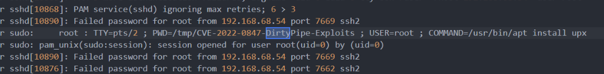
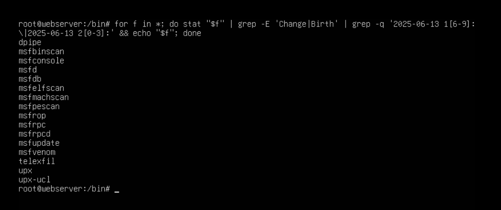
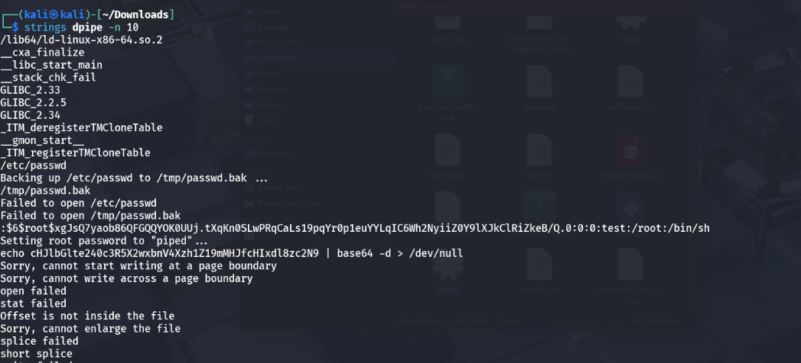
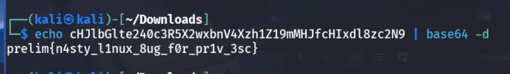

# 2 Privesc - CTF Challenge Writeup

## Challenge Information
- **Name**: Privesc  
- **Points**: 10  
- **Category**: Forensic  
- **Objective**: Investigate a suspected privilege escalation attack on a compromised Linux system. Identify traces of exploitation, determine the method used (e.g., kernel-level exploits), and locate the attacker’s payload or tool to recover the flag.

---

## Solution

### 1. **Challenge Context**
- This challenge is a **continuation** of a previous one involving a compromised web server.
- The focus now shifts from initial access to **post-exploitation and privilege escalation**.

---

### 2. **Identifying the Exploit**
- By analyzing `auth.log`, strong evidence suggested the use of **Dirty Pipe (CVE-2022-0847)**, a well-known Linux privilege escalation vulnerability.
- Searched `/tmp` for related payloads, but no direct Dirty Pipe exploit scripts were found.
- However, the logs clearly indicated its probable use, especially due to `/tmp/dirty-pipe` references.


    


    


    

---

### 3. **Following False Leads**
- Then I found the metasploit folder, which turns out to be a big rabbit hole, but I didn't know back then. 
- So i thought, oh, the dirtypipe was actually attacked but no files? And I saw a metasploit. Means the attacker used metasploit to attack. 
- But metasploit has no artifact folders, so it's hard to analyse and that is when I knew it was a rabbit hole. 
- But I did learn some stuff through the metasploit, I looked into how the dirtypipe is used, how the exploits are made and eventually found that you can selectively attack binaries for dirtypipe.
- For examples, I can dirtypipe /bin/su so everytime you do su, you are root. For example
- With that in mind, I then assumed and guessed that when the log /tmp/dirty-pipe happened, that is around the time the dirtypipe attack took place. 
- So the idea that I had was to find binaries that are modified during the time when dirtypipe attack took place. But this assumption turned out to be wrong but I still got the flag. 😂

---

### 4. **Using Timestamp Forensics**
- Based on `/tmp/dirty-pipe` logs, the estimated time of attack was around `2025-06-13 16:33`.


    


- Used a shell one-liner to find **files modified around that timestamp**:

    ```bash
    for f in *; do stat "$f" | grep -E 'Change|Birth' | grep -q '2025-06-13 1[6-9]:\|2025-06-13 2[0-3]:' && echo "$f"; done
    ```


  


- This surfaced several modified binaries. The key suspects were:
  - `upx` – also mentioned in `errors.log`
  - `dpipe` – likely short for “dirty pipe”
  - `telexfil` – possibly “telegram exfiltration”

---

### 5. **Finding the Flag**
- Focused on `dpipe`, since the name directly aligned with the exploit.
- Running `strings` on `dpipe` revealed embedded data, including the **flag**.


    


    

---

## Flag
The flag for this challenge is:  
`prelim{n4sty_l1nux_8ug_f0r_pr1v_3sc}`

---

## Summary
"Privesc" walks players through the reality of Linux post-exploitation forensics. By correlating timestamps, exploit logs, and suspicious binaries, the challenge simulates real-world attacker behavior using known CVEs like **Dirty Pipe**. Despite some misdirections, thorough file inspection and creative assumptions led to successful flag extraction.

---
