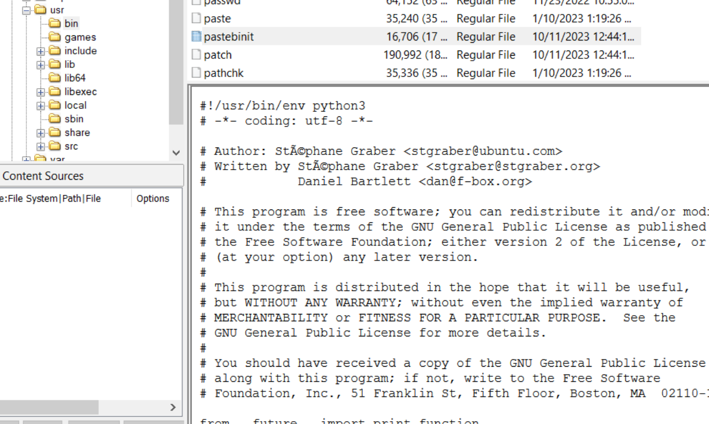
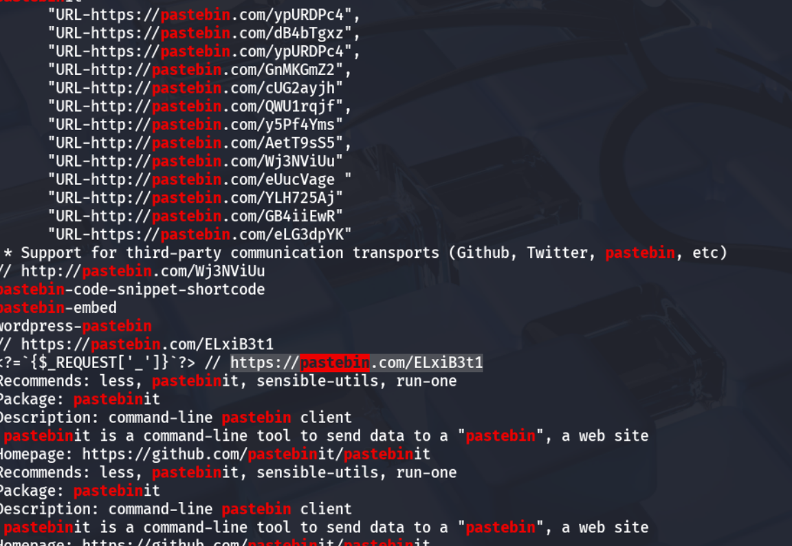
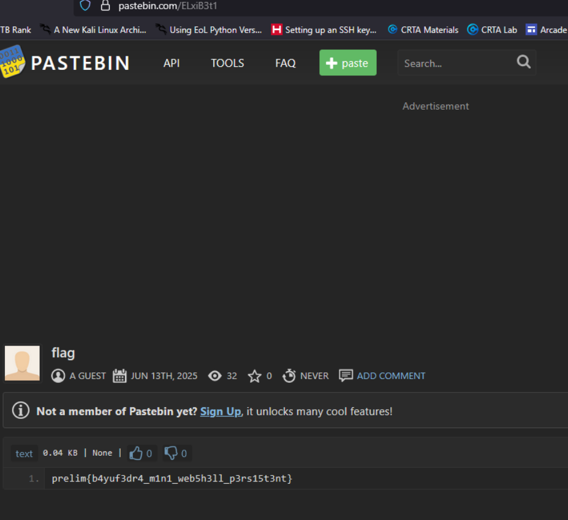

# 5 Persistent - CTF Challenge Writeup

## Challenge Information
- **Name**: Persistent  
- **Points**: 10  
- **Category**: Forensics  
- **Objective**: Identify evidence of attacker persistence by analyzing remnants left on a compromised system, including outbound communication artifacts such as Pastebin links. Use digital forensic techniques to trace how the attacker maintained access or control.

---

## Solution

### 1. **Context from Prior Challenges**
- While working on earlier forensic challenges, multiple references to **Pastebin links** were observed.
- This led to a hunch that attackers may have used public paste services for **command-and-control** or persistence mechanisms.

    

---

### 2. **Artifact Discovery**
- Initially found and viewed these links using tools like **FTK Imager**, but over time, lost access to the original FTK session.
- Pivoted to using `strings` on the disk image or memory dump directly within a Linux environment to extract readable content.

---

### 3. **Filtering Pastebin Links**
- Ran `strings` and manually inspected output to **identify any suspicious URLs**, especially those pointing to `pastebin.com`.
- Several Pastebin links surfaced — a sign that the attacker might be using these to drop payloads or commands.

    

---

### 4. **Manual Link Checking**
- Visited each of the Pastebin URLs manually.
- Eventually discovered one link that **contained the flag directly**, likely as part of a fake webshell, embedded configuration, or encoded marker.

    

---

## Flag
The flag for this challenge is: `prelim{b4yuf3dr4_m1n1_web5h3ll_p3rs15t3nt}`

---

## Summary
"Persistent" is a light yet insightful forensics challenge centered around identifying how attackers can leverage **public tools** (like Pastebin) for **persistence and covert data handling**. It reinforces the value of string searches and manual validation when automated tools fall short or time is limited.

---
