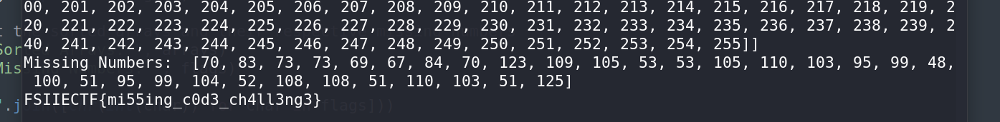

# ASCII Hunt CTF Challenge Writeup

## Challenge Information
- **Name**: ASCII Hunt
- **Points**: 1
- **Category**: Crypto
- **Objective**: Decode the flag from a given set of arrays using missing numbers.

## Solution
To solve the "ASCII Hunt" challenge, follow these steps:

1. **Initial Analysis**:
   - You are provided with a large Python array consisting of multiple sub-arrays.
   - Each sub-array has a length of 255, and there are 32 sub-arrays.

2. **Understanding the Data**:
   - Each sub-array likely represents a set of ASCII values.
   - Given that a flag is typically around 32 characters long, it is reasonable to assume that the 32 sub-arrays correspond to the characters in the flag.

3. **Analyzing the Arrays**:
   - Went back and forth to the description and eventually found that each sub-array should ideally contain all values from 0 to 255.
   - Identify that some values are missing from these arrays.

4. **Finding Missing Values**:
   - Write a script to find the missing values in each sub-array. This involves sorting the arrays and determining which numbers from 0 to 255 are absent.
      ```python
      import ast

      file_path = 'enc.txt'
      with open(file_path, 'r') as file:
          file_contents = file.read()

      arrays = ast.literal_eval(file_contents)
      full_range = set(range(256))

      flags = []

      for array in arrays:
          array.sort()  # Sort the array
          # Find the missing numbers
          missing = list(full_range - set(array))
          missing.sort()  # Sort the missing numbers
          flags.append(missing[0])

      print("Sorted Arrays: ", arrays)
      print("Missing Numbers: ", flags)
      print("".join([chr(int(char)) for char in flags]))
     ```

5. **Constructing the Flag**:
   - The missing numbers in the arrays correspond to the ASCII values of the characters in the flag.
   - Convert these missing numbers to their ASCII characters to reconstruct the flag.

6. **Implementing the Script**:
   - Example Python script to find missing values:

7. **Flag Retrieval**:
   - Run the script to find the missing numbers and convert them to characters.
   - The resulting string is the flag.

      

