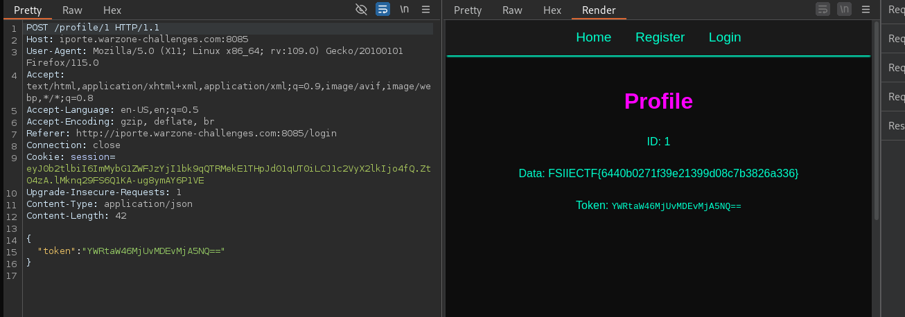

# IPORTE CTF Challenge Writeup

## Challenge Information
- **Name**: IPORTE
- **Points**: 1
- **Category**: Web
- **Objective**: Exploit a vulnerability to retrieve information about other users, including the flag.

## Solution
To solve the "IPORTE" challenge, follow these steps:

1. **Initial Exploration**:
   - The challenge page provides functionality to register and log in.
   - Register an account to obtain a base64 encoded string.

      

2. **Decoding the Base64 String**:
   - Decode the base64 encoded string received after registration.
   - The decoded string reveals your username and the registration date.

3. **Exploiting the Information Retrieval Functionality**:
   - Note that it’s possible to retrieve information about other users by using their base64 encoded strings.
   - You can send a POST request with a base64 encoded string to get details of other users.

4. **Retrieving the Admin Information**:
   - Obtain the base64 encoded string for the admin user.
   - Send a POST request with this encoded string to get the admin's details.

      

5. **Getting the Flag**:
   - Retrieve the flag from the admin's information or as part of the response to the request.

      

