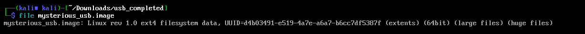
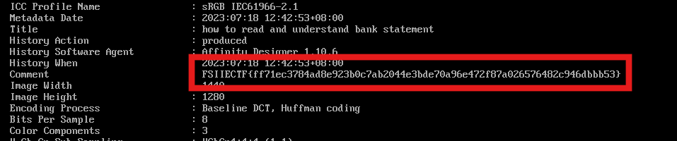

# Forensics CTF Challenge Writeup

## Challenge Information
- **Name**: USBChall
- **Points**: 1
- **Category**: Forensics

## Solution
1. I started by running the **file** command on the given mysterious file.
   - It identified the file as a **Linux file system**.

      

2. I used **foremost** to extract the files from the system.
   - Only two files were extracted: a **docx** file and an **image**.

3. The contents of both the **docx** and the **image** seemed empty and provided no useful information.

4. I then used **exiftool** on the image, and this revealed the flag.

    

## Flag
FSIIECTF{XXXXXXXXXX}
