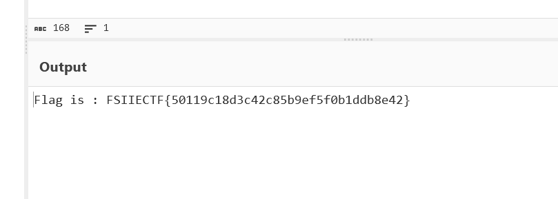

# Forensics CTF Challenge Writeup

## Challenge Information
- **Name**: Apache Logs
- **Points**: 1
- **Category**: Forensics
- **Objective**: Analyze the Apache log file to uncover and decode suspicious data.

## Solution
1. **Log Analysis**:
   - The provided Apache log file is relatively short.
   - Upon reviewing the logs, identify a URL with **URL-encoded** suspicious data.

      

2. **URL Decoding**:
   - Decode the URL using standard URL decoding techniques to reveal an ASCII representation of letters.

      

3. **Conversion**:
   - Convert the ASCII representation into readable text, which reveals the flag.

      

## Flag
FSIIECTF{XXXXXXXXXX}
