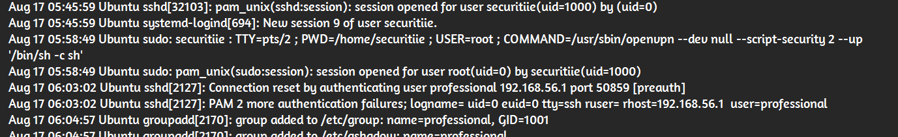
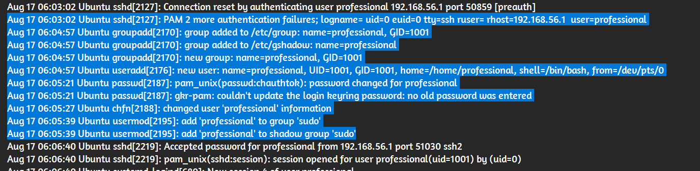

# Forensics CTF Challenge Writeup

## Challenge Information
- **Name**: Auth Log
- **Points**: 1
- **Category**: Forensics
- **Objective**: Answer five questions based on the provided authentication logs.

## Solution
1. **Attack Type**:
   - By analyzing the logs, it becomes evident that there are multiple failed login attempts, indicating a **brute force attack**.

      

2. **Protocol**:
   - The protocol used in the attack is **SSH**, as seen in the logs.

3. **Vulnerability Used**:
   - The attack involved privilege escalation, specifically related to **sudo**.

      

4. **Vulnerable Binary**:
   - There are command logs mentioning **openvpn**, which is the vulnerable binary.

5. **MITRE Sub Technique ID**:
   - A search identified the relevant MITRE ID for this attack: **T1136.001**.

      

## Flag
FSIIECTF{bruteforce_ssh_sudo_openvpn_T1136.001}
