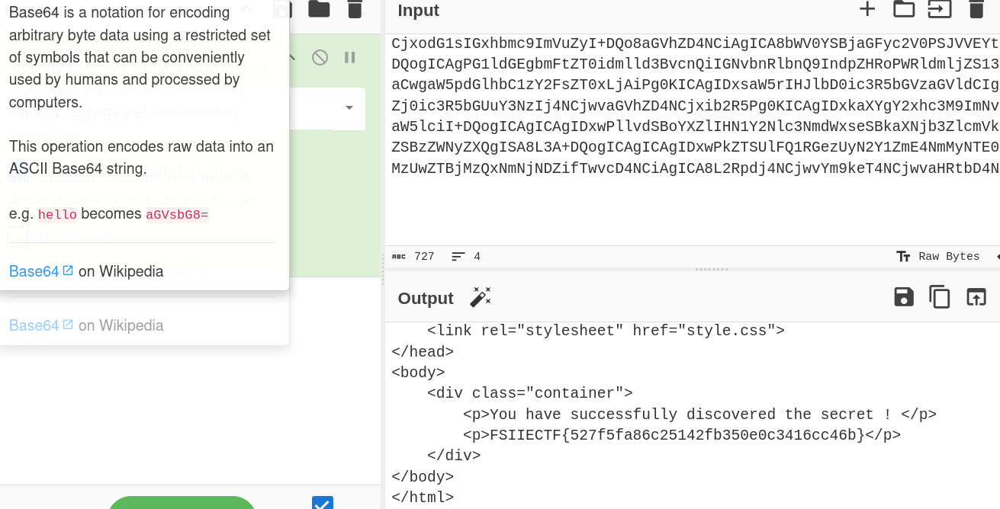

# Kakegura Secret CTF Challenge Writeup

## Challenge Information
- **Name**: Kakegura Secret
- **Points**: 1
- **Category**: Web
- **Objective**: Exploit a Local File Inclusion (LFI) vulnerability to retrieve the flag.

## Solution
To solve the "Kakegura Secret" challenge, follow these steps:

1. **Initial Exploration**:
   - The website appears to be a PHP-based application.
   - Clicking on the "Flag" page does not display the flag directly.


      

2. **Identifying the Vulnerability**:
   - By clicking around the website, you can suspect the presence of a Local File Inclusion (LFI) vulnerability, possibly involving PHP filters.
   - The way the page renders suggests that files may be included dynamically.


      

3. **Exploiting LFI with PHP Filters**:
   - Use PHP filters to exploit the LFI vulnerability to read sensitive files.
   - Example payload:
     ```php
     ?page=php://filter/convert.base64-encode/resource=index.php
     ```
   - By leveraging the filter to base64 encode the content of files, retrieve the contents of important files, including the one containing the flag.


      

4. **Flag Retrieval**:
   - Successfully exploit the LFI to access the flag and decode it.


      

