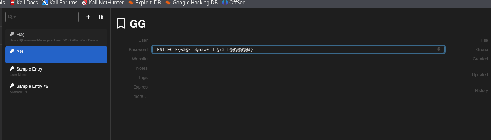

# Cryptography CTF Challenge Writeup

## Challenge Information
- **Name**: KeepJohn
- **Points**: 1
- **Category**: Cryptography

## Solution
1. Initially, I thought to use **keepass2john** and then crack the password using **John the Ripper**, but none of the passwords in the provided wordlist matched.
   - Even after trying the entire **rockyou** wordlist, it didn’t work.
   
2. Upon re-reading the challenge description, I realized it mentioned **variations of commonly used passwords**. 

3. Remembering John Hammond’s video on a tool that generates variations of passwords, I used **Munge** (a tool designed for this purpose): [Munge GitHub](https://github.com/Th3S3cr3tAg3nt/Munge).
   - Maybe the John in the challenge refers to John Hammond? [John Hammond Video](https://www.youtube.com/watch?v=nNvhK1LUD48&t=608s)

4. I generated a list of passwords using Munge, and this helped me find the correct password.

   

5. After opening the **kdbx** file with the found password, I retrieved the flag.

   

## Flag
FSIIECTF{XXXXXXXXXX}
