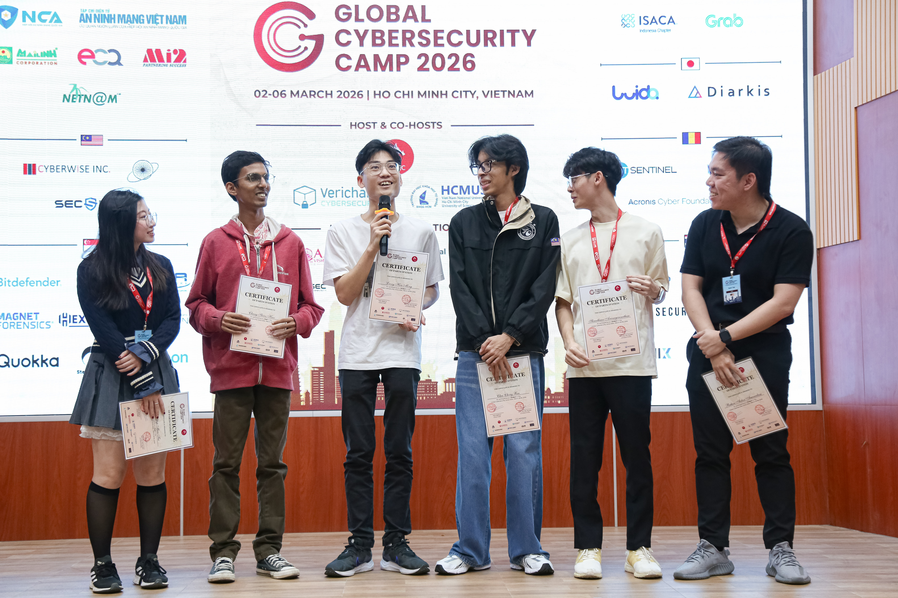
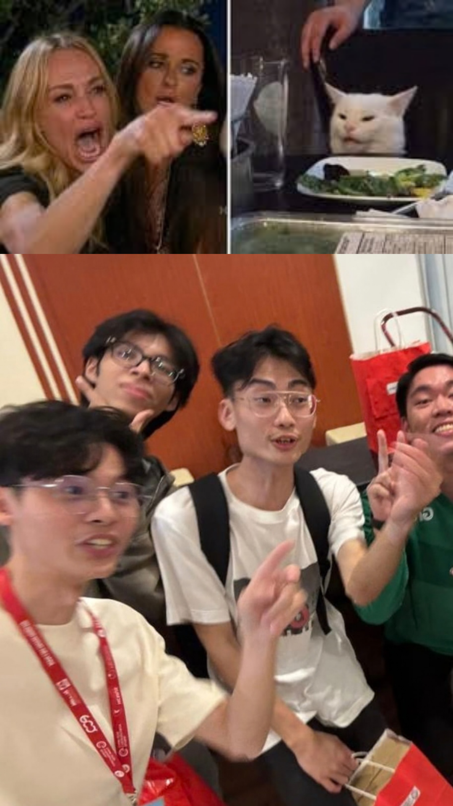

# Global Cybersecurity Camp (GCC) 2026 – Vietnam 🇻🇳

## Introduction

From **March 2 to March 6, 2026**, I had the chance to attend **Global Cybersecurity Camp (GCC) 2026** in **Ho Chi Minh City, Vietnam**.

Global Cybersecurity Camp is a **week-long international cybersecurity training camp** that brings together cybersecurity students from many countries. The main goal of the camp is to help grow the next generation of cybersecurity professionals and also build stronger collaboration between countries in the cybersecurity community.

Around **45 selected students** from different countries join every year. The camp includes **technical lectures, hands-on workshops, and group projects**, together with cultural exchange activities.

This year, I was very lucky to represent **Malaysia** together with **[Ruhan](https://www.linkedin.com/in/ruhan-aidan-amaradasa-104113155/), [Han Ming](https://www.linkedin.com/in/hmleong0510/), and [Shree](https://www.linkedin.com/in/0x251e/)**. During the week, we met many talented participants from different countries and learned from experienced security researchers and industry practitioners.

One funny and memorable part outside the classes was seeing **Han Ming aura farming on the piano** with some improvised music. It became one of those random GCC moments that made the whole week feel even more special.

---

## What is Global Cybersecurity Camp?

Global Cybersecurity Camp (GCC) is an international initiative that focuses on **developing cybersecurity talent and strengthening the global security community**.

The camp is organized by cybersecurity communities and educational partners from multiple countries, with support from industry sponsors who believe in growing cybersecurity talent.

This year we had participants from the following countries:

- Japan  
- Singapore  
- Malaysia  
- Taiwan  
- Thailand  
- Vietnam  
- India  
- Indonesia  
- Romania  

The program combines different activities including:

- **Technical cybersecurity workshops**
- **Expert-led lectures**
- **Team-based security projects**
- **International collaboration**
- **Cultural exchange**

Because of this, GCC is not only about technical learning, but also about building long-term friendships and connections with people in the cybersecurity community.

---

## Technical Sessions

One of the main parts of GCC is the **technical sessions** delivered by experienced security researchers.

During GCC 2026, we joined several sessions covering different areas of cybersecurity such as:

- **IoT / ICS Security**
- **AV / EDR Kernel Protection**
- **Binary Hardening with CET**
- **Hypervisor Security**
- **Agentic AI for Offensive Security**
- **Entra ID Attack Chains**

Most of the sessions had both **theoretical explanation and practical exercises**, so it was not only listening to lectures, but also understanding how the concepts work in real attack and defense scenarios.

### Introduction to IoT/ICS Security & Firmware Analysis Skills

The first class by **[Mars Cheng](https://www.linkedin.com/in/marscheng93/)** focused on **IoT/ICS security**, threat trends, attack surface, and firmware analysis. The workshop started from the basics of what IoT and ICS environments are, then slowly moved into how these systems are used in real office, industrial, and operational technology environments.

What I liked about this class is that it did not treat IoT as only smart home devices. It also connected the topic to **ICS/SCADA/CPS security** and real operational impact. This made the class feel much more practical and realistic.

One part I found especially useful was the **firmware analysis** section. The workshop introduced a full toolchain for analyzing firmware images, including tools like **Binwalk, Ghidra, QEMU, Firmadyne, FACT, Firmwalker, Pwntools, Radare2, Burp Suite, and GDB**. There was also an **IoT-MQTT protocol simulation**, which helped us understand how communication between devices and brokers works in a more realistic IoT setup.

Overall, this class gave a very strong introduction to embedded devices, firmware structure, and network attack surface. It was a very good foundation for people who want to understand IoT security more deeply.

### Super Hat’s Kernel Trick: Social Engineering the AV/EDR Kernel Protection

This session by **[Shenghao Ma](https://www.linkedin.com/in/aaaddress1/)** was honestly one of the most memorable classes for me during the whole camp.

The topic was not just about bypassing AV/EDR in a simple way. It was more about **understanding the protection layers deeply enough to disable them, abuse them, or work around them in a smarter way**. The workshop looked at AV/EDR protection from different layers, including **malware file landing scan, Windows privilege tokens, PP(L) for process access integrity, kernel-based self anti-tamper, and sandbox-related behavior**.

What made this class very interesting was the mindset behind it. Instead of only thinking, “find one exploit and break everything,” the session showed how an attacker can look at the problem step by step:

1. **Can the malware even land on disk without being stopped by file scan?**  
2. **Can a trusted or privileged token be abused to interfere with AV/EDR?**  
3. **How does Protected Process Light (PPL) affect process access?**  
4. **How do kernel self anti-tamper protections stop attempts to disable security products?**  
5. **If direct bypass is too hard, can the environment itself be socially engineered at the privilege and protection layer?**

This class was very hands-on and offensive in mindset. It was not only theory. The workshop included demos and labs on **file landing malware scan**, **local privilege escalation**, **Windows privilege token abuse using WinDbg**, and **anti-tamper exploitation**.

One very cool part was the section on **building your own vulnerable driver to exploit**, then using **BYOD + DKOM** techniques for **LPE**, **stripping PP(L)**, **LSASS dumping**, and studying AV/EDR anti-tampering and sandbox behavior.

For me, the biggest takeaway from this class was the thinking process. It showed that advanced operators do not always need a fancy 0-day to break protections. Sometimes the real power comes from understanding **Windows privilege management**, how **security products trust certain operations**, and how **kernel protection logic can be manipulated indirectly**.

This session really changed the way I think about endpoint security. It felt less like “exploit one bug and win,” and more like **abusing assumptions between multiple protection layers**. That idea made the whole class feel much deeper and more realistic.

### Practical Binary Hardening with Control-flow Enforcement Technology (CET)

The class by **Michael and Kento Oki** focused on **Control-flow Enforcement Technology (CET)** and how modern binaries can be hardened against control-flow hijacking attacks.

The session explained how modern exploitation often relies on techniques like **ROP, JOP, and COP**, and why software mitigations alone are sometimes still not enough. From there, the workshop introduced **Intel CET**, especially the two important parts:

- **Shadow Stack** for protecting the backward edge  
- **Indirect Branch Tracking (IBT)** for protecting the forward edge  

I liked this class because it connected exploitation knowledge with actual hardware-backed mitigations. Instead of only saying “CET makes exploitation harder,” the session explained how **return addresses are protected**, how **ENDBR32/ENDBR64** is used for indirect branch validation, and how violations can trigger **Control Protection faults (#CP)**.

The class also touched on **Linux / Windows implementation**, real-world adoption, and some practical limitations and assumptions behind CET. It was a very useful session for understanding where binary hardening is going in modern systems.

### Hypervisors for Hackers

The class by **[Satoshi Tanda](https://www.linkedin.com/in/satoshitanda/)** was about **hypervisors from a security researcher perspective**.

The session started with virtualization history, moving from **full emulation**, to **trap-and-emulate**, to **para-virtualization**, before going into **hardware-assisted virtualization** like **Intel VT-x**. After that, the workshop explained how a hypervisor works internally, including concepts like **VMX root / non-root operation**, **VMCS**, **VM-entry**, and **VM-exit**.

What I enjoyed most was that the session did not present hypervisors as only infrastructure technology. Instead, it showed hypervisors as a **security boundary** and even a **security enhancement tool**.

One demo used a vulnerable driver similar to **capcom.sys**, where the exploit tried to clear **CR4.SMEP** and execute attacker-controlled code in kernel mode. Then the workshop showed how a hypervisor can detect and prevent this by monitoring sensitive state changes, especially around **CR4.SMEP**, with minimal overhead.

This made the class feel very practical. It connected CPU architecture, virtualization internals, and exploit prevention in a way that was much easier to understand and appreciate from an offensive security learner perspective.

### Agentic AI for Offensive Security

The **Agentic AI** workshop by **[Kar Wei Loh](https://www.linkedin.com/in/kar-wei-loh/)** explored how AI can be used in a more autonomous way for offensive security tasks.

Instead of using AI only for searching or summarizing, the session explained **agentic AI** as something that can break a goal into smaller steps, reason about what to do next, use tools, and keep memory of past actions. The workshop then moved into a more practical setup using **Opencode**, where participants learned how to create an agent environment, define **workflows**, and write **skills and tools** for the agent.

One thing I found interesting was that the workshop showed both the strengths and also the weaknesses of agentic workflows. For example, the AI agent could make progress on pentest-style tasks, but it could also make bad decisions, miss small operational steps, or go in the wrong direction if the workflow was not designed carefully.

That made the class feel realistic instead of overhyped. I also liked that the workshop was very builder-oriented. It was not only “use this AI tool,” but more like “understand how the agent thinks, write better skills, improve workflows, and build your own agent for your own use case.”

### Entra ID Attack Chains: Born in the Cloud, Breached on the On-Prem

The session by **Jimmy Su and John Jiang** focused on **identity attack paths in Entra ID and hybrid environments**.

This class was especially interesting because it showed how a compromise path can start from a **low-privilege Entra-joined machine** and move toward a **higher-privilege Azure target**. The workshop was beginner-friendly but still very practical, with **five hands-on labs** and a CTF-style setup.

The session covered topics such as:

- **Azure / Resource / Entra ID fundamentals**
- Understanding **AT, RT, and PRT**
- Abusing an **Entra-joined machine** to obtain **PRT**
- Using stolen token material for **vertical privilege escalation in Azure**
- **Azure recon**
- **On-premises lateral movement** through **Entra Pass-the-Cert**
- **Azure persistence**

What I liked about this class was how clearly it explained the relationship between cloud identity, device identity, and hybrid access. The discussion around **PRT**, **PRT cookie**, and **Pass-the-Cert** made it easier to understand how identity abuse can move across endpoint, browser, cloud, and even on-prem environments.

It also showed that identity is not only a cloud problem or only an AD problem anymore, but really both together. That was one of the most valuable points from this session for me.

Overall, the technical sessions at GCC 2026 covered a very wide range of topics, from embedded systems and firmware, to Windows internals, kernel protection, identity attack paths, virtualization, and AI-assisted offensive workflows. That wide range was one of the things that made the camp so valuable for me.

---

## Group Project

Another important part of GCC is the **group assignment**, where participants are placed into teams with members from different countries.

Each group needs to work together to solve a cybersecurity problem and present the results at the end of the camp.

Our **Group 8** consisted of **Hidenori, [Rohit](https://www.linkedin.com/in/rohitprasanth/), [Amelia](https://www.linkedin.com/in/amelia-chua-xxx/), [Vo](https://www.linkedin.com/in/threalwinky/), and me**. We worked on a project related to **Android security**, focusing on **APK intent exploitation**.

The objective of our project was to:

- Identify insecure **Android intent exposures**
- Analyze how applications communicate using **Android intents**
- Build a **mobile application scanner** that can detect vulnerable apps

The project required both **security research and software development**. We spent many late nights discussing ideas, debugging the application, and improving the detection logic.

Many days we were working until **2–3 AM**, trying to finish the implementation before the final presentation.

I was very thankful to have such a strong team. Everyone contributed different ideas and strengths, and I think that was one big reason why our project worked out well in the end.

In the end, our effort paid off and **Group 8 received 1st place** for the group assignment.

It was a very satisfying moment for the whole team.

---

## Cultural Exchange

Besides the technical learning, GCC also gives opportunities for participants to experience the culture of the host country.

During the week, we had some time to explore **Ho Chi Minh City** and experience Vietnamese culture. A lot of my favorite memories actually came from these small moments outside class, where everyone was just eating, talking, joking around, and learning about each other’s backgrounds.

Some memorable moments included:

- Trying **Vietnamese pho**
- Eating **banh mi**
- Trying **jellyfish**
- Drinking **Vietnamese coffee**
- Drinking **Vietnamese tea**
- Exploring the city with other participants
- Having many conversations about cybersecurity research and career paths

Meeting people from different countries and learning about their local cybersecurity communities was one of the most valuable parts of the camp for me.

---

## Acknowledgements

I would like to give a big thank you to **[SherpaSec](https://www.linkedin.com/company/sherpasec/)** for sponsoring the Malaysian participants and making this opportunity possible.

Special thanks also to **[Shiau Huei](https://www.linkedin.com/in/chang-shiau-huei/)** and **[Ryan](https://www.linkedin.com/in/ryanyap555/)** for managing the logistics and coordinating everything during the event.

Their help made the whole experience much smoother for all participants.

---

## Final Thoughts

Attending **Global Cybersecurity Camp 2026** was a very meaningful experience for me.

Besides learning many technical topics, the camp also allowed me to:

- collaborate with talented cybersecurity students from many countries  
- learn from experienced researchers and professionals  
- build new friendships in the cybersecurity community  

GCC is not just a training program. It is also a place where the international cybersecurity community connects and grows together.

I am very grateful to be part of this experience and hope to apply what I learned in my future cybersecurity work.

If you have the chance to attend GCC in the future, I would definitely recommend it.

It is truly a very memorable experience.

At the end of this post, I also want to include some of my favorite images from the camp. I think photos can capture the feeling better than words sometimes, especially the moments with teammates, new friends, classes, food, and all the small memories in between.

