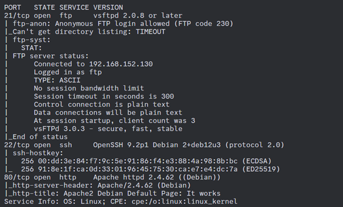
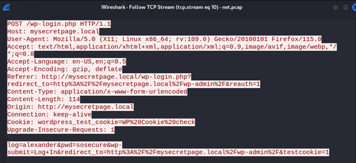
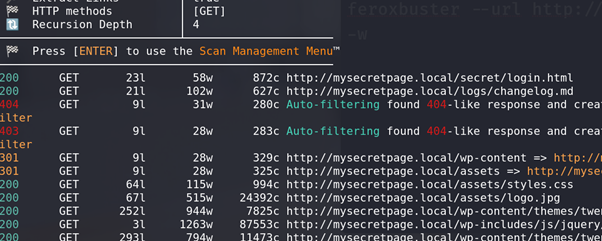
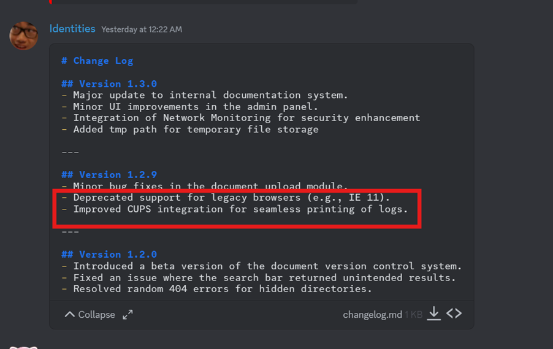

# MCC 2024 Box CTF Challenge Writeup

## Challenge Information
- **Name**: MCC 2024 Box
- **Points**: 90
- **Category**: Boot2Root
- **Objective**: Gain root access to the machine by exploiting vulnerabilities and misconfigurations.

## Solution
To solve the "MCC 2024 Box" challenge, follow these steps:

1. **Information Gathering**:
   - First, obtained the IP address of the target machine and ran an `nmap` scan to identify open ports.
   - The scan revealed ports 21 (FTP), 22 (SSH), and 80 (HTTP) were open.
   - Port 21 (FTP) allowed anonymous login, which could be useful for data retrieval.

      

2. **Accessing the FTP Server**:
   - Connected to the FTP server on port 21 and disabled passive mode to list the available files.
   - Downloaded a `.pcap` file from the FTP server for further analysis.

      

      

3. **PCAP File Analysis**:
   - Opened the `.pcap` file and analyzed the network traffic.
   - Discovered user credentials (`chris` and `alexander`), the domain name, and some WordPress-related endpoints.

      

4. **Exploring WordPress**:
   - Ran `feroxbuster` to brute force additional directories, which revealed several interesting files:
     - `changelog.md`, `secret/login.html`, `xmlrpc.php`, and `wp-admin.php`.
   - Tried logging into WordPress admin and the secret login page using the credentials from the PCAP file, but it didn’t work.
   - Attempted SQL injection on the login pages, but it was unsuccessful.
   - Tried exploiting `xmlrpc.php`, but that also failed.

      

5. **Reviewing Changelog for CUPS Vulnerabilities**:
   - A hint pointed us back to the `changelog.md` file.
   - Inside, we found that CUPS (Common Unix Printing System) had 4 CVEs related to it, which might be exploitable.

      

      

6. **Attempting CVE Exploits**:
   - We tried several POCs (Proof of Concepts) related to the CUPS vulnerabilities, but none of them worked.
   - Despite trying every known POC available, we couldn't gain further access.

7. **Revisiting the PCAP File**:
   - A hint suggested revisiting the `.pcap` file for additional clues.
   - After further inspection, we discovered a port knocking sequence.
     - The sequence was 77, 67, 2024, 631, which was similar to techniques seen in previous CTF challenges like the one in Petronas CTF 2023.
     - The PCAP file showed a failed connection attempt to port 631, followed by a successful connection after the knocking sequence.

      

8. **Performing Port Knocking**:
   - We attempted the port knocking sequence by connecting to ports 77, 67, 2024, and then port 631.
   - After knocking on the correct ports, we were able to successfully connect to port 631, which provided access to the CUPS service.

      

      

9. **Exploiting CUPS for RCE**:
   - Using an RCE exploit found in a similar writeup on the [0xdf blog](https://0xdf.gitlab.io/2024/10/02/htb-evilcups.html), we were able to execute remote code on the machine as the `LP` user.

      

      

10. **Privilege Escalation**:
    - As the `LP` user, we found some SUID binaries that could be useful for privilege escalation and escalated to the `alexander` user.

      

    - Due to the unstable shell, running automated tools like `linpeas.sh` was not feasible, so we manually enumerated the `alexander` user’s environment.

      

    - Eventually, we discovered SSH keys that could potentially provide further access.

      
      

11. **Cracking the Passphrase for SSH Keys**:
    - Attempted to use the SSH keys, but they were passphrase-protected.
    - We explored `notes.txt` and tried several password combinations, including those we found earlier (for `alexander` and `LP`), as well as MD5 hashes of those values, but none of them worked.

        

    - Finally, we used John the Ripper to crack the passphrase, and successfully retrieved the SSH key’s passphrase.

        

12. **Gaining Stable Shell**:
    - After logging in as `alexander`, we finally had a stable shell and could run any tools required for further enumeration but it is not needed in this case.
    - We ran `sudo -l` and discovered that the user `alexander` had permission to edit any file on the system.

      

    - We modified the `sudoers` file to grant `alexander` full root privileges.

      

13. **Achieving Root Access**:
    - With the `sudoers` file modified, we gained root access to the machine.

      

## Flag
MCC24{h3ll0_fr0m_pr1nt1ng_s3rv1c3s}
MCC24{4bus1ng_su1d}
MCC24{g00d_j0b_3v3ry0n3}
