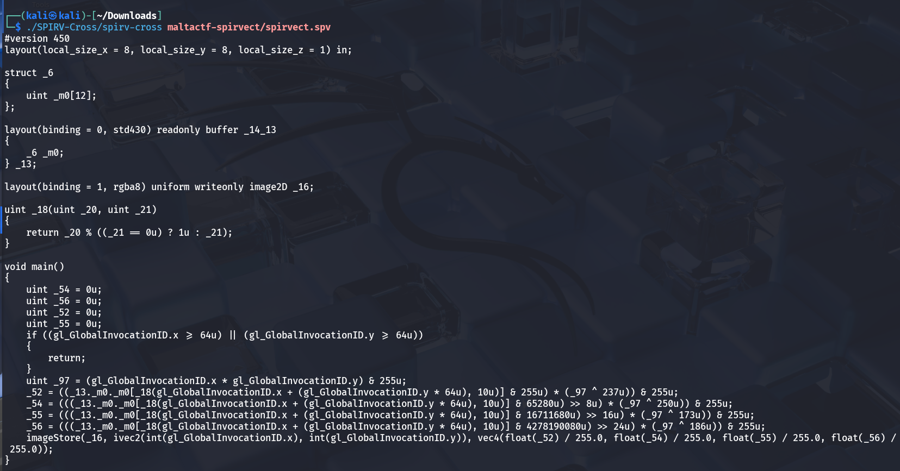
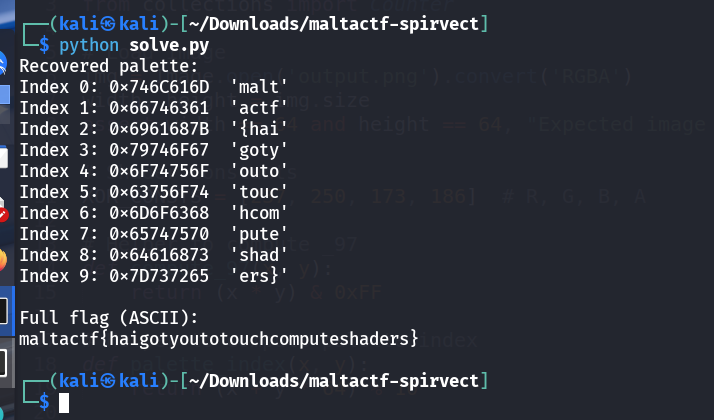

# Spirvect - CTF Challenge Writeup

## Challenge Information
- **Name**: Spirvect  
- **Points**: 100  
- **Category**: Reverse Engineering  
- **Objective**: The goal of this challenge is to reverse engineer an obfuscated **Khronos SPIR-V binary**, reconstruct the logic used to generate an output image, and recover the original flag hidden within its data transformations.

---

## Solution

### 1. **Understanding the Binary**
- We are given a compiled **SPIR-V** binary — an intermediate shader format used by Vulkan and OpenGL.
- The first step is to disassemble the binary for analysis.
- Using a tool like **SPIRV-Cross**, we can decompile the SPIR-V binary into readable shader source code:

    ```bash
    spirv-cross input.spv 
    ```

    
---

### 2. **Analyzing Shader Logic**
- After decompilation, the shader source reveals the core image-generation logic:

    - Operates on a **64×64 pixel grid**.
    - For each pixel `(x, y)`:
        - Computes a pseudo-random index into a 12-element `uint` array (`modulo 10`).
        - Extracts individual RGBA bytes from this `uint`.
        - Each byte is multiplied by an **XOR-mixed** version of `x*y` to introduce variation.
        - The final result is written to an `image2D` object (`output.png`).

---

### 3. **Challenge Objective**
- Given the **output image (`output.png`)**, our task is to **reverse** the transformations to recover the original flag.

---

### 4. **Reversing the Transformation**
- The main challenge lies in the **MOD operation**, which makes exact inversion non-trivial.
- Since `modulo` is not bijective, multiple inputs can map to the same output — a true inversion is not possible.

---

### 5. **Brute Force Strategy**
- To work around this:
    - A **brute-force approach** is used to test all possible candidates for the mod result.
    - For each pixel:
        - Try possible pre-images and compute forward.
        - Compare against the actual pixel value in `output.png`.
    - Retain candidate values that best match the observed image data.

    ```python
    import numpy as np
    from PIL import Image
    from collections import Counter

    img = Image.open('output.png').convert('RGBA')
    width, height = img.size
    assert width == 64 and height == 64, "Expected image size 64x64"

    # Shader constants
    XOR_CONSTS = [237, 250, 173, 186] 

    def compute_97(x, y):
        return (x * y) & 0xFF

    def palette_index(x, y):
        return (x + y * 64) % 10

    def brute_force_reverse(mixer, out_val):
        candidates = []
        for p in range(256):
            if (p * mixer) & 0xFF == out_val:
                candidates.append(p)
        return candidates

    palette_candidates = {i: [] for i in range(10)}

    for y in range(height):
        for x in range(width):
            _97 = compute_97(x, y)
            mixers = [
                _97 ^ XOR_CONSTS[0],
                _97 ^ XOR_CONSTS[1],
                _97 ^ XOR_CONSTS[2],
                _97 ^ XOR_CONSTS[3],
            ]

            pixel = img.getpixel((x, y))
            index = palette_index(x, y)

            all_channel_candidates = []

            for c in range(4):
                m = mixers[c]
                out_val = pixel[c]
                chan_candidates = brute_force_reverse(m, out_val)
                all_channel_candidates.append(chan_candidates)

            for r in all_channel_candidates[0]:
                for g in all_channel_candidates[1]:
                    for b in all_channel_candidates[2]:
                        for a in all_channel_candidates[3]:
                            palette_candidates[index].append((r, g, b, a))

    final_palette = {}

    for idx, candidates in palette_candidates.items():
        if not candidates:
            final_palette[idx] = (0, 0, 0, 0)
            continue

        counter = Counter(candidates)
        most_common_entry, count = counter.most_common(1)[0]
        final_palette[idx] = most_common_entry

    print("Recovered palette:")
    flag_str = ""

    for i in range(10):
        r, g, b, a = final_palette[i]
        hex_value = (a << 24) | (b << 16) | (g << 8) | r
        hex_str = f"0x{hex_value:08X}"

        ascii_chars = [chr(c) if 32 <= c <= 126 else '.' for c in [r, g, b, a]]
        ascii_str = ''.join(ascii_chars)
        flag_str += ascii_str

        print(f"Index {i}: {hex_str}  '{ascii_str}'")

    print("\nFull flag (ASCII):")
    print(flag_str)
    ```

---

### 6. **Flag Recovery**
- By applying this method across the entire image, we can extract candidate values.
- As these are assembled, they form the original flag.


    

---

## Flag
The flag for this challenge is:  
`maltactf{haigotyoutotouchcomputeshaders}`

---

## Summary
The "Spirvect" challenge teaches players how to approach **binary shader analysis**, particularly when dealing with **SPIR-V** — an often overlooked binary format in CTFs. It also demonstrates practical challenges around reversing operations that involve **modulo arithmetic** and shows the utility of brute-force recovery when full inversion is mathematically infeasible.

---
