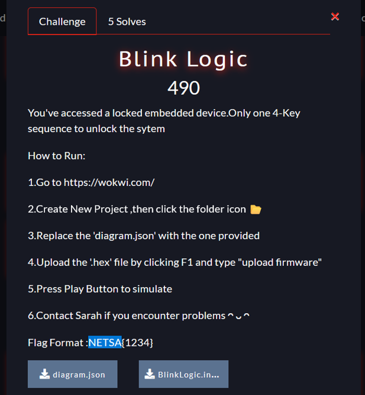
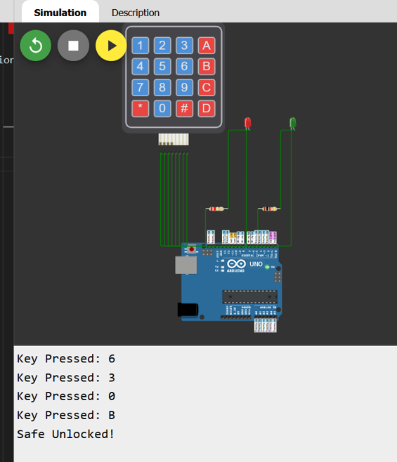

# Blink Logic CTF Challenge Writeup

## Challenge Information
- **Name**: Blink Logic  
- **Points**: 100  
- **Category**: IoT  
- **Objective**: Analyze a firmware file and determine the correct keypad input to unlock an IoT system running on Wokwi simulation.

## Solution
To solve the "Blink Logic" challenge, follow these steps:

1. **Challenge Setup**:
   - The challenge provides a compiled firmware file in `.hex` format and instructs the user to simulate an IoT project using [Wokwi](https://wokwi.com), a popular online Arduino/IoT simulation platform.
   - The goal is to determine the correct key combination on a virtual keypad to "unlock" the system and retrieve the flag.


      

2. **Converting the Firmware**:
   - Started by converting the `.hex` file into a binary format using the `objcopy` tool:
     ```
     objcopy -I ihex BlinkLogic.ino.hex firmware.bin
     ```
   - This step makes it easier to inspect the raw data inside the firmware.


      

3. **Static Analysis**:
   - Ran the `strings` command on the `.bin` file to extract human-readable content.
     ```
     strings firmware.bin
     ```
   - Among the output, several familiar keypad characters were visible (`123A456B789C*0#D`), which appeared to represent a standard 4x4 keypad layout.


      

4. **Identifying the Flag**:
   - Noticed an unusual string near the end of the readable content: `630B`.
   - This did not match the keypad layout directly but stood out from the rest of the data — suggesting it was the intended key sequence.

5. **Testing the Key on Wokwi**:
   - Loaded the given project on Wokwi and manually entered `630B` on the virtual keypad.
   - The system responded with an "unlocked" message, confirming the key was correct.


      

## Flag
netsa{630B}
