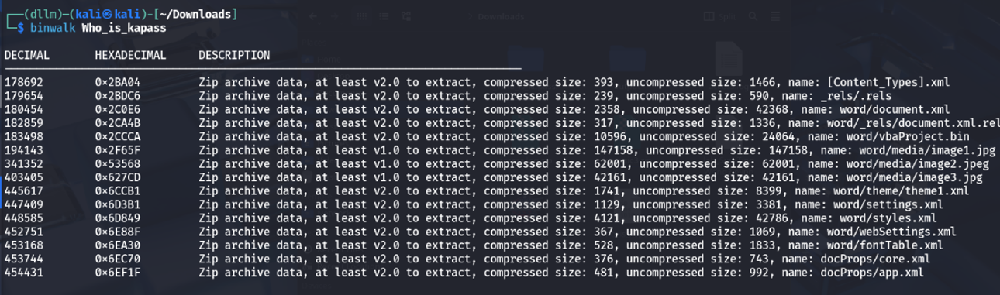
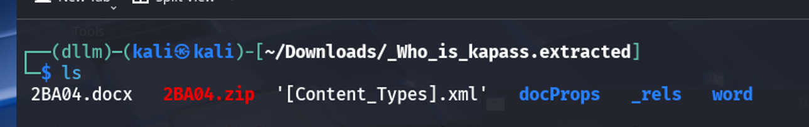
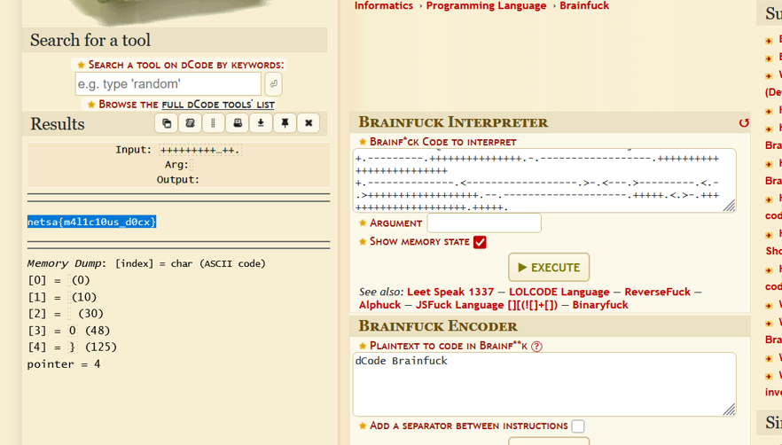

# Kapas CTF Challenge Writeup

## Challenge Information
- **Name**: Kapas  
- **Points**: 100  
- **Category**: Steganography  
- **Objective**: Analyze a suspicious document file to uncover hidden malicious content and extract the flag.

## Solution
To solve the "Kapas" challenge, follow these steps:

1. **Initial Inspection**:
   - The file provided had no extension, making it unclear what type of file it was.
   - Used the `file` command on Linux to determine its format.
   - Identified as a `.docx` (Microsoft Word) document.

      

2. **Extracting Contents**:
   - Used `binwalk` to extract the contents of the `.docx` file.
   - This revealed various internal files and directories typical of Office documents, such as `word/document.xml`, `vbaProject.bin`, etc.

      

3. **Reviewing Document Content**:
   - Opened `document.xml` to check for embedded content.
   - Filtered for strings containing "meow" (a recurring term in the document), but none were meaningful or led to the flag.

      

4. **Analyzing VBA Macros**:
   - Attempted to use tools like `olevba` to analyze potential VBA macros.
   - However, tools failed to parse the macros properly — possibly due to corruption or obfuscation.
   - Decided to inspect the `vbaProject.bin` file manually using the `strings` command.

          

      

5. **Discovering Obfuscated Payload**:
   - Within the strings output, noticed several cryptography-related keywords (e.g., AES), but none led to useful results.
   - Found a suspicious, compact string that resembled Brainfuck code.

      

      

6. **Decoding the Brainfuck Payload**:
   - Confirmed the string was valid Brainfuck code.
   - Used an online Brainfuck interpreter to decode the payload.
   - The decoded output revealed the flag in plaintext.

      

      
      

## Flag
netsa{m4l1c10us_d0cx}
