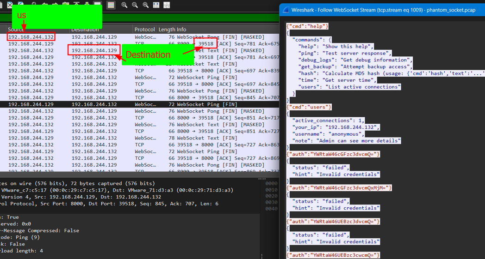

# Phantom Protocol I CTF Challenge Writeup

## Challenge Information
- **Name**: Phantom Protocol I  
- **Points**: 100  
- **Category**: Forensics  
- **Objective**: Identify the WebSocket endpoint that the attacker connected to by analyzing network traffic.

## Solution
To solve the "Phantom Protocol I" challenge, follow these steps:

1. **Context**:
   - This is the first challenge in the "Phantom Protocol" series.
   - The challenge requires identifying the WebSocket endpoint used by an attacker to initiate communication.

2. **Analyzing the Network Traffic**:
   - Loaded the provided `.pcap` file into Wireshark for analysis.
   - Filtered the traffic using the WebSocket protocol (`websocket`) to isolate relevant packets.

3. **Identifying IP Addresses**:
   - Observed multiple WebSocket handshake packets and ongoing connections.
   - By examining the IP headers and context of the WebSocket traffic, determined that the victim’s IP address was `192.168.244.132`.

4. **Determining the Attacker**:
   - Based on the direction and initiation of the WebSocket connection, identified `192.168.244.129` as the attacker's IP address.
   - The connection was established on port `39518`, with the endpoint being `/ws`.

5. **Constructing the Endpoint**:
   - Combined the IP, port, and path to form the WebSocket URL:
     ```
     ws://192.168.244.129:39518/ws
     ```

      

## Flag
netsa{ws://192.168.244.129:39518/ws}
