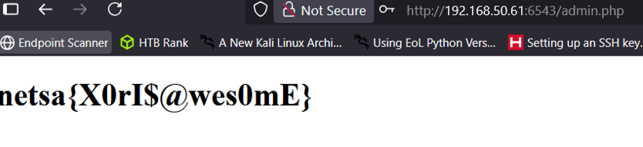

# XorisEzy CTF Challenge Writeup

## Challenge Information
- **Name**: XorisEzy  
- **Points**: 100  
- **Category**: Web  
- **Objective**: Identify and exploit a SQL injection vulnerability in a user search feature, reverse the password obfuscation method, and retrieve the flag by logging in as the administrator.

## Solution
To solve the "XorisEzy" challenge, follow these steps:

1. **Exploring the Application**:
   - After registering and logging into the web application, noticed a search functionality to look up user accounts.
   - Suspected this search feature might be vulnerable to either IDOR or SQL injection based on its behavior and error responses.

2. **Testing for SQL Injection**:
   - Inputting a single quote (`'`) into the search box triggered an SQL error message.
   - This confirmed that the backend was not sanitizing user input, indicating a SQL injection vulnerability.

      

3. **Exploiting the Vulnerability**:
   - Crafted several payloads to enumerate the database, focusing on dumping data from the `information_schema.tables` and related metadata.
   - Eventually retrieved usernames and their associated 'hashed' passwords.

      

4. **Investigating the Password Hashing**:
   - Noticed that passwords were obfuscated using a simple method — likely XOR.
   - Registered a test account with a known password and retrieved the obfuscated version to reverse-engineer the XOR key.
   - Discovered that the key used for regular accounts was `KeyForX`.

      

5. **Bypassing XOR Obfuscation for Admin**:
   - Tried to decode the administrator's password using the same XOR key but failed.
   - After extensive trial and error, hypothesized the key might be a variation of `KeyForX`.
   - Incrementally tested longer variants until `KeyForXor` correctly decoded the admin password.

      

      

6. **Logging in as Admin**:
   - Used the recovered admin credentials to log in.
   - Upon successful login, the application revealed the flag.

      

## Flag
netsa{X0rI$@wes0mE}
