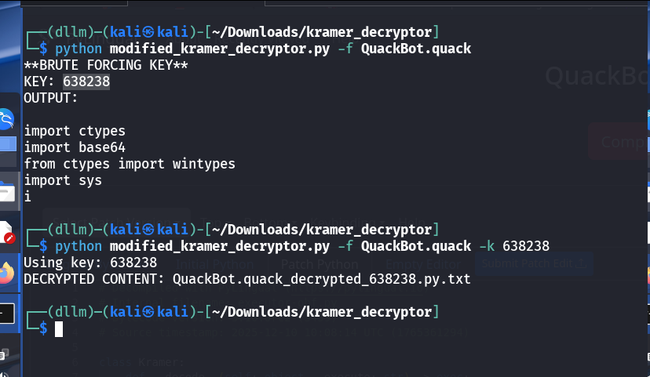
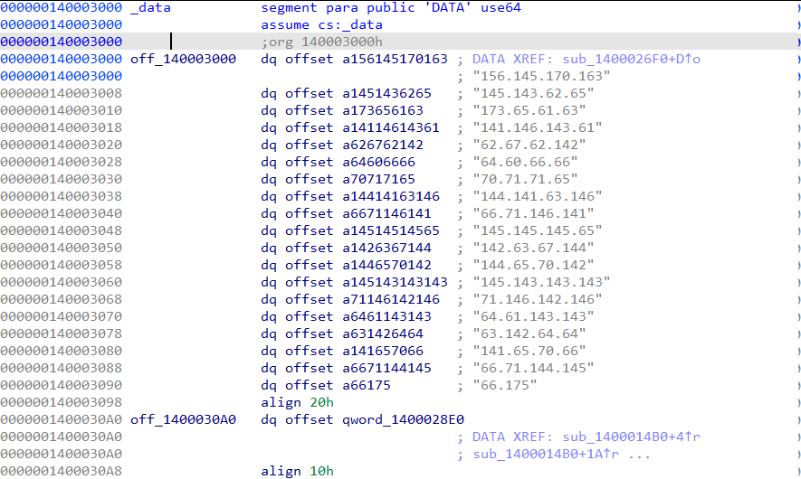

# quack-bot

## Challenge Information
- **Name**: quack-bot
- **Points**: 10
- **Category**: Reverse Engineering
- **Objective**: Analyze a Kramer-encrypted PYC binary and its staged shellcode to extract the final payload and recover the flag.

## Solution

1. **Spotting the PYC artifact**
   - The `QuackBot.quack` file stands out as a PYC-compiled binary.
   - This sets the stage for Python bytecode-focused reversing.

   

2. **Decompiling with an online tool**
   - Used the online viewer to reverse the bytecode at https://pylingual.io/view_chimera?identifier=35d0286b3a3d4c7cb833ef6de56995ac9f8d04dafd9187347e4bd7c10c54e19a.
   - The output confirmed the code was readable but still protected.

   

3. **Recognizing Kramer encryption**
   - The decompiled output shows Kramer-style protection.
   - Switched to the Kramer decryptor at https://github.com/jcarndt/kramer_decryptor/blob/main/kramer_decryptor.py.

4. **Hitting a decryptor issue**
   - The script failed to extract the needed `ceb6` blob.
   - The PYC data still clearly contained the `ceb6` pattern, so the extraction logic looked too strict.

   

5. **Confirming the regex mismatch**
   - The decryptor’s pattern matching did not capture the full encrypted content.
   - This mismatch blocked further progress until the regex was adjusted.

   

6. **Relaxing the regex and updating the script**
   - The regex was loosened to capture the `ceb6 ... )` blob reliably.
   - With this change, the decryptor could extract and process the encrypted data.

```python
import argparse
import binascii
import re

def parse_arguments():
    parser = argparse.ArgumentParser(description="Decrypt a .pyc file that has been encrypted with Kramer encryption.")

    parser.add_argument(
        '-f', '--file',
        required=True,
        help='Path to the input file'
    )

    parser.add_argument(
        '-k', '--key',
        required=False,
        default=None,
        type=int,
        help='Key value to use for decrypting file (if known)'
    )

    return parser.parse_args()

class Kyrie(): #<- Class taken directly from Kramer encryptor

    def _dkyrie(text: str):
        r = ""
        for a in text:
            if a in strings:
                i = strings.index(a)+1
                if i >= len(strings):
                    i = 0
                a = strings[i]
            r += a
        return r

    def _encrypt(text: str, key: str = None):
        if type(key) == str:
            key = sum(ord(i) for i in key)
        t = [chr(ord(t)+key)if t != "\n" else "ζ" for t in text]
        return "".join(t)

    def _decrypt(text: str, key: str = None):
        if type(key) == str:
            key = sum(ord(i) for i in key)
        return "".join(chr(ord(t)-key) if t != "ζ" else "\n" for t in text)

class Key: #<- Class taken directly from Kramer encryptor

    def encrypt(e: str, key: str):
        e1 = Kyrie._ekyrie(e)
        return Kyrie._encrypt(e1, key=key)

    def decrypt(e: str, key: str):
        text = Kyrie._decrypt(e, key=key)
        return Kyrie._dkyrie(text)
    
python_indicators = {
    'keywords': {'import'} #<- Add more words as you see fit like 'def', 'str', 'int', 'set', 'list', 'dict'
    #'keywords': {'import', 'def', 'str', 'int'} <- Example
}

strings = "abcdefghijklmnopqrstuvwxyz0123456789"

def main():
    args = parse_arguments()

    file_path = args.file
    key = args.key

    if '\\' in file_path:
        file = file_path.split('\\')[-1]
    elif '/' in file_path:
        file = file_path.split('/')[-1]
    else:
        file = file_path

    #Open file
    with open(file_path, 'rb') as f:
        content = f.read().decode('latin-1', errors='ignore')

    #Grab necessary encrypted strings from .pyc file
    pattern = r'ceb6.*ceb6\)'
    match = re.search(r'ceb6.*?\)', content, flags=re.DOTALL)
    if not match:
        raise SystemExit("No match for encrypted blob (looked for 'ceb6 ... )'). Try searching for the actual delimiter.")
    result = match.group(0)
    if match:
        result = match.group(0)

    #If key argument is provided
    if key is not None:
        print(f"Using key: {key}")
        content_split = result.split('/')

        _content_ = ""
        key = key

        #Decrypt content
        for item in content_split:
            try:
                unhexed = binascii.unhexlify(item).decode() #<- Unhexlify first
                _content_ += Key.decrypt(unhexed, key=key) #<- Send to decryptor
            except:
                pass

        #Create file name
        file = file + "_decrypted_" + str(key) + ".py.txt"
        print("DECRYPTED CONTENT: " + file)
        #Output _content_ to file
        with open(file, 'w', encoding='utf-8') as f:
            f.write(_content_)

    #If no key is provided
    else:
        print("**BRUTE FORCING KEY**")
        
        #Grab only beginning content, adjust as you see fit.
        first_600 = result[:600]
        content_split = first_600.split('/')

        #Begin brute forcing
        i = 3
        while i < 1000001:
            _content_ = ""

            for item in content_split:
                try:
                    unhexed = binascii.unhexlify(item).decode() #<- Unhexlify first
                    _content_ += Key.decrypt(unhexed, key=i) #<- Send to decryptor
                except:
                    pass
            for keyword in python_indicators['keywords']: #<- Check if likely a decrypted python script
                if keyword in _content_:
                    print("KEY: " + str(i) + "\r\nOUTPUT:\r\n" +_content_) #<- If so, print key used as well as output to verify
            i += 1

if __name__ == "__main__":
    main()
```

   

7. **Seeing shellcode execution**
   - The decrypted output shows the next stage runs shellcode.
   - That pushed the analysis toward shellcode behavior instead of Python logic.

   

8. **Converting shellcode to an EXE**
   - Emulation with scdbg did not work.
   - The shellcode was converted to an executable with https://github.com/accidentalrebel/shcode2exe.

   

   
   

9. **Recreating the API hash logic**
   - The loader avoids plaintext API strings and skips direct `GetProcAddress` usage.
   - It computes a 64-bit hash from module and export names and compares XORed pairs against constants.
   - A script was written to reproduce the hashing routine and map constants back to real API names.

```python
from typing import Tuple
import struct

MASK32 = 0xFFFFFFFF

def rol32(x, r):
    return ((x << r) & MASK32) | ((x & MASK32) >> (32 - r))

def ror32(x, r):
    return ((x & MASK32) >> r) | ((x << (32 - r)) & MASK32)

def sub_40C246(block_words: Tuple[int,int,int,int], a2: int, a3: int) -> Tuple[int,int]:
    """
    Implements the core compression loop from the decompiled sub_40C246.
    Inputs:
      - block_words: tuple of four 32-bit words [w0, w1, w2, w3] (little-endian from 16 bytes)
      - a2, a3: 32-bit state values (input)
    Returns:
      - (result, a3_final) as 32-bit unsigned ints
    """
    # initialize as in decomp
    v6 = block_words[3]  # a1[3]
    v7 = block_words[2]  # a1[2]
    v8 = block_words[0]  # *a1
    v10 = block_words[1] # a1[1]
    result = a2
    # loop 0..0x1A (27 iterations)
    for v5 in range(0x1B):  # 27 rounds
        v9 = v6
        # result = v8 ^ (a3 + ROR(result,8))
        result = (v8 ^ ((a3 + ror32(result, 8)) & MASK32)) & MASK32
        # v6 = v5 ^ (v8 + ROR(v10,8))
        v6 = (v5 ^ ((v8 + ror32(v10, 8)) & MASK32)) & MASK32
        # a3 = result ^ ROL(a3,3)
        a3 = (result ^ rol32(a3, 3)) & MASK32
        # v10 = v7
        v10 = v7
        # v8 = v6 ^ ROL(v8,3)
        v8 = (v6 ^ rol32(v8, 3)) & MASK32
        # v7 = v9
        v7 = v9
    # return result and the final a3 value (these are the two 32-bit outputs we will use)
    return result & MASK32, a3 & MASK32

def pad_and_hash(name_bytes: bytes, seed_a2: int, seed_a3: int) -> Tuple[int,int]:
    """
    Implements sub_40C17F-like streaming + padding. Returns two 32-bit words (a2_final, a3_final).
    We follow the decompiled logic: buffering up to 16 bytes, applying 0x80 padding, writing bit-length
    into the last dword (8*length), and calling the compression. The mapping used here returns
    (a2_final, a3_final) where each compression returns (ret, new_a3) and we XOR both into state.
    """
    # Buffer processing similar to the decompiled loop.
    a2 = seed_a2 & MASK32
    a3 = seed_a3 & MASK32
    total_bytes = 0
    buf = bytearray()
    done_flag = False
    # append bytes into buffer until we hit NUL or reach 64 bytes (the decomp checks for v4==64)
    # but here we simply consume the whole input
    # The decomp reads bytes up to first NUL; so we should stop at first NUL if present.
    # The code lowercased the module name earlier; caller ensures input is lowercased.
    # We'll use the provided bytes as-is and stop at the first 0 if present.
    for i, b in enumerate(name_bytes):
        if b == 0 or i == 64:
            break
        buf.append(b)
        total_bytes += 1

    # Now perform padding and compress as in the decompiled function.
    # Process in 16-byte blocks
    i = 0
    blocks = []
    data = bytes(buf)
    # The decompiled code had a fairly specific padding: append 0x80 then zero out remaining, possibly compress twice.
    # We'll follow the standard "append 0x80, then zeros, then length in bits in last dword", with at most two compressions.
    # Build a single padded buffer
    pad = bytearray(data)
    pad.append(0x80)
    # pad with zeros until length % 16 == 12 (so we can put 4-byte length at end) OR pad full block if needed
    while (len(pad) % 16) != 12:
        pad.append(0x00)
    # append 4-byte little-endian bit length
    bitlen = (total_bytes * 8) & MASK32
    pad += struct.pack('<I', bitlen)
    # Now split into 16-byte blocks
    blocks = [pad[j:j+16] for j in range(0, len(pad), 16)]
    # For each block, call compression
    for block in blocks:
        # interpret as 4 little-endian uint32 words
        w = struct.unpack('<4I', block)
        ret, out_a3 = sub_40C246(w, a2, a3)
        # XOR into states as a reasonable mapping of the decompiled register interactions
        a2 = (a2 ^ ret) & MASK32
        a3 = (a3 ^ out_a3) & MASK32
    return a2, a3

def hash_name(name: str, seed_a2: int, seed_a3: int) -> Tuple[int,int]:
    # The caller lowercases module names first. For exports, the name is used as-is.
    # We'll lowercase module names where requested by caller externally.
    b = name.encode('ascii', errors='ignore')
    return pad_and_hash(b, seed_a2, seed_a3)

# constants from your dump (these are compared as XOR results in peb_walk)
TARGET_A3 = 0xB0A9C6C0
TARGET_A4 = 0x6197C707
SEED_A5 = 0xE1F5C30F
SEED_A6 = 0x5FBF2E07

# test names
module = "kernel32.dll"
export = "CreateThread"

# note: module names in the decomp are lowercased before hashing
mod_hash = hash_name(module.lower(), SEED_A5, SEED_A6)
exp_hash = hash_name(export, SEED_A5, SEED_A6)

print("Module:", module, "-> hash pair (hex):", tuple(hex(x) for x in mod_hash))
print("Export:", export, "-> hash pair (hex):", tuple(hex(x) for x in exp_hash))

# compute XORs and compare with targets
xor1 = mod_hash[0] ^ exp_hash[0]
xor2 = mod_hash[1] ^ exp_hash[1]
print("\nComputed XORs:")
print("mod_hash[0] ^ exp_hash[0] =", hex(xor1), " expected:", hex(TARGET_A3))
print("mod_hash[1] ^ exp_hash[1] =", hex(xor2), " expected:", hex(TARGET_A4))
print("\nMatch A3?", xor1 == TARGET_A3)
print("Match A4?", xor2 == TARGET_A4)

# If it didn't match, try a small search over plausible case variants for module and export
if xor1 != TARGET_A3 or xor2 != TARGET_A4:
    print("\nTrying variations of case (module) and common export forms...")
    candidates_mod = [module, module.lower(), module.upper(), module.replace(".dll","")]
    candidates_exp = [export, export.lower(), export.upper(), export.replace("Create","create")]
    found = []
    for cm in set(candidates_mod):
        mh = hash_name(cm.lower(), SEED_A5, SEED_A6)
        for ce in set(candidates_exp):
            eh = hash_name(ce, SEED_A5, SEED_A6)
            if (mh[0] ^ eh[0]) == TARGET_A3 and (mh[1] ^ eh[1]) == TARGET_A4:
                found.append((cm, ce, mh, eh))
    if found:
        print("Found match(s):")
        for cm, ce, mh, eh in found:
            print("  Module:", cm, "Export:", ce)
            print("   mod hash:", tuple(hex(x) for x in mh))
            print("   exp hash:", tuple(hex(x) for x in eh))
    else:
        print("No match found with simple variations. The original decomp used register outputs from the compression in a slightly different way.")
        print("If you want, I can try to exactly emulate the register-based outputs (using multiple values returned by the compression) to replicate the original match exactly.")
```

   

10. **Assuming likely API targets**
   - Dynamic API resolution suggests common calls like `VirtualAlloc()`.
   - This points to a staged payload being copied into memory.

   

11. **Finding the next routine**
   - Debugging shows a call into `sub_40ab95()`.
   - That call anchors the next stage of analysis.

   

12. **Tracing payload copy and decrypt**
   - `sub_40C5B1()` copies a large blob into memory at `v6` (0x1a0000).
   - `sub_40C2A9()` then decrypts that payload.

   

13. **Preparing a memory dump**
   - A breakpoint at `sub_40C2A9()` reveals argument 1 as the key, argument 2 as the IV, and argument 3 as the destination buffer.
   - The target region to dump is `0x001B023C` with a length of `0x5184` bytes.

```python
import ida_bytes
import idc

def memdump(ea, size, file):
    data = ida_bytes.get_bytes(ea, size)
    if data is None:
        print("Failed to read memory at 0x{:X}".format(ea))
        return

    with open(file, "wb") as fp:
        fp.write(data)
        print("Memdump Success!")
```

14. **Dumping after decryption**
   - The IDA script was used right after `sub_40C2A9()` completed.
   - This produced the decrypted blob for the next step.

   
   

15. **Reading the dumped strings**
   - The dumped data contains readable strings now.
   - That confirms the decryption worked as expected.

   

16. **Handling a non-EXE stage**
   - The extracted `idkwhatstage.bin` is not a valid EXE.
   - Binwalk failed to extract it automatically.

   

17. **Force-extracting the next binary**
   - Manual extraction was done with `dd if=idkwhatstage.bin of=stage2.exe bs=1 skip=4172 status=progress`.
   - The resulting `stage2.exe` is the next payload to inspect.

   

18. **Identifying bind shell behavior**
   - The new binary opens a TCP listener and launches `cmd.exe`.
   - That behavior matches a bind shell stage.

   

19. **Spotting odd IP addresses**
   - `off_140003000` contains a list of invalid-looking IPs.
   - The format hints at octal-encoded bytes rather than real dotted decimals.

   
   

20. **Decoding octal to ASCII**
   - Converting the octal bytes to ASCII reveals the final string.
   - The decoding script used is below.

```python
#!/usr/bin/env python3

# Hard-coded dotted “IPs” (each dot-part is an OCTAL byte)
OCTAL_DOTTED = [
    "156.145.170.163",
    "145.143.62.65",
    "173.65.61.63",
    "141.146.143.61",
    "62.67.62.142",
    "64.60.66.66",
    "70.71.71.65",
    "144.141.63.146",
    "66.71.146.141",
    "145.145.145.65",
    "142.63.67.144",
    "144.65.70.142",
    "145.143.143.143",
    "71.146.142.146",
    "64.61.143.143",
    "63.142.64.64",
    "141.65.70.66",
    "66.71.144.145",
    "66.175",
]

def decode_octal_dotted(lines):
    out = bytearray()
    for line in lines:
        for part in line.split("."):
            out.append(int(part, 8) & 0xFF)  # base-8 -> byte
    return out

if __name__ == "__main__":
    b = decode_octal_dotted(OCTAL_DOTTED)
    print(b.decode("utf-8", errors="replace"))
```

   

## Flag
The flag for this challenge is: `nexsec25{513afc1272b40668995da3f69faeee5b37dd58beccc9fbf41cc3b44a58669de6}`
