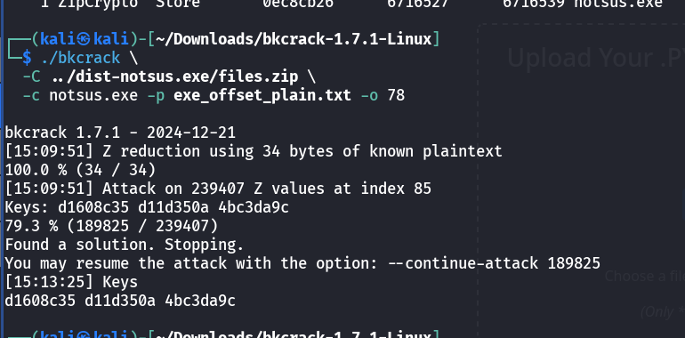
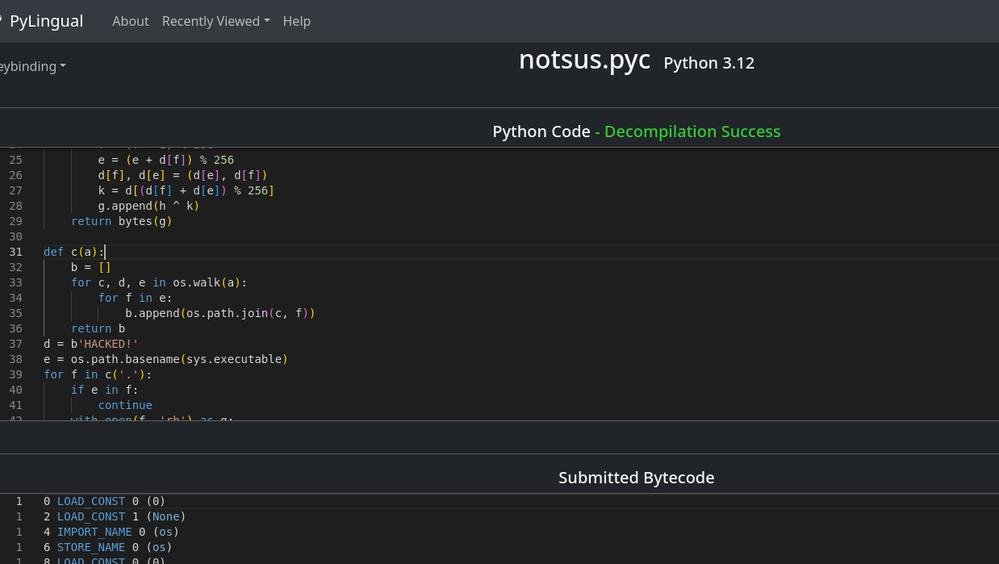
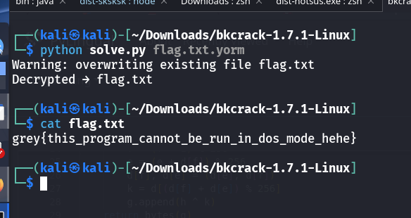

# Notsus.exe CTF Challenge Writeup

## Challenge Information
- **Name**: Notsus.exe  
- **Points**: 100  
- **Category**: Forensics  
- **Objective**: Analyze and decrypt files extracted from a ZIP archive using a known plaintext attack and reverse engineer a bundled Python executable to extract the final flag.

## Solution

1. **Understanding the Challenge**:
   - Provided with a ZIP-based executable (`dist-notsus.exe`) that, when unzipped, throws a bunch of errors.
   - From prior experience, this behavior hints at a **classic PKZIP encryption** challenge solvable with `bkcrack`, a known plaintext attack tool.

2. **Initial File Inspection**:
   - Extracting the ZIP reveals two files:
     - `notsus.exe` — a Windows executable.
     - `flag.txt.yorm` — a file with an unfamiliar `.yorm` extension, likely custom or encrypted.
   - The path of least resistance is to first target the `.exe`, since the standard DOS executable header often contains a predictable string:  
     ```
     This program cannot be run in DOS mode.
     ```


     

3. **Identifying the Known Plaintext Offset**:
   - The known string appears mid-file, not at the start. Therefore, the correct offset is crucial.
   - Use the command to locate it:
     ```bash
     grep -aob $'\x21This program' known.exe
     ```
   - This returns the byte offset (e.g., `78`) which will be passed to `bkcrack`.


      

4. **Preparing for Known Plaintext Attack**:
   - Save the known plaintext string to a file:
     ```bash
     echo -ne 'This program cannot be run in DOS mode.\r\r\n' > exe_offset_plain.txt
     ```
   - Perform the attack:
     ```bash
     ./bkcrack -C ../dist-notsus.exe/files.zip -c notsus.exe -p exe_offset_plain.txt -o 78
     ```
   - This reveals the internal encryption keys:  
     `d1608c35 d11d350a 4bc3da9c`


      

5. **Decrypting the ZIP Contents**:
   - Use the recovered keys to fully decrypt both files:
     ```bash
     ./bkcrack -C ../dist-notsus.exe/files.zip -c notsus.exe -k d1608c35 d11d350a 4bc3da9c -d notsus.exe
     ./bkcrack -C ../dist-notsus.exe/files.zip -c flag.txt.yorm -k d1608c35 d11d350a 4bc3da9c -d flag.txt.yorm
     ```

6. **Reverse Engineering `notsus.exe`**:
   - The executable is actually a Python program bundled using **PyInstaller**.
   - Use the following tools to extract and decompile the executable:
     - [Pyinstxtractor](https://pyinstxtractor-web.netlify.app/)
     - [Pylingual](https://pylingual.io/) (for decompiling .pyc files)
   - Analyzing the code reveals the logic to decrypt the `flag.txt.yorm` file using a custom decryption routine.


      

7. **Decrypting the Flag File**:
   - Re-implement the decryption algorithm based on the logic found in the decompiled script.
   - Running it on `flag.txt.yorm` reveals the flag.

      
       

## Flag
grey{this_program_cannot_be_run_in_dos_mode_hehe}
