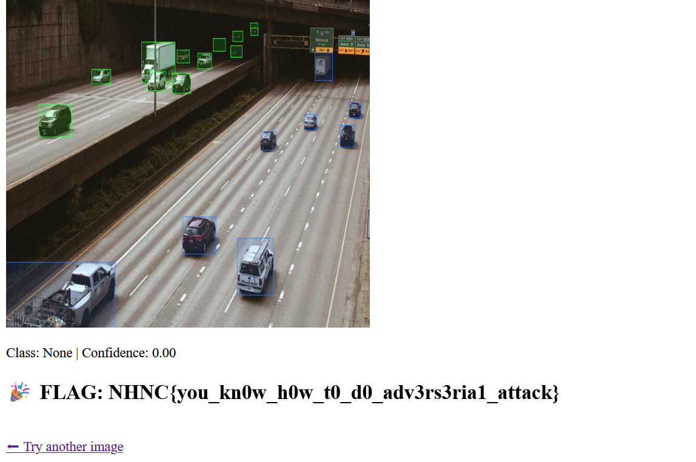

# attack CNN? - CTF Challenge Writeup

## Challenge Information
- **Name**: attack CNN?  
- **Points**: 10  
- **Category**: Misc  
- **Objective**: Perform an adversarial attack against two provided YOLO (You Only Look Once) models. Craft an image such that the two models produce **significantly different predictions**, demonstrating an understanding of adversarial machine learning techniques.

---

## Solution

### 1. **Understanding the Goal**
- Given two object detection models:
  - `yolo_v8.pt`
  - `yolo_v10.pt`
- The objective is to **generate a single adversarial image** that causes the models to output different results under the following conditions:

    ```python
    different_prediction = result_v8["class_name"] != result_v10["class_name"]
    confidence_gap = abs(result_v8["confidence"] - result_v10["confidence"]) >= 0.4
    ```

- Both conditions must be satisfied to consider the attack successful.

---

### 2. **Choosing the Attack Method**
- This is a classic use case for **adversarial machine learning** techniques, targeting deep neural networks.
- Two common attacks were considered:
  - **FGSM (Fast Gradient Sign Method)** – faster, simpler
  - **PGD (Projected Gradient Descent)** – more effective but slower

- For this challenge, **PGD was used** for better perturbation control and higher attack success rate.

---

### 3. **Executing the Attack**
- Loaded both YOLO models using an appropriate framework (e.g., PyTorch + Ultralytics YOLOv8).
- Started from a base image and applied the **PGD adversarial attack**, modifying the image iteratively to:
  - Change the prediction **class name**
  - Create a **≥ 0.4 confidence gap**


    ```python
    import torch
    import cv2
    import numpy as np
    import os
    from ultralytics import YOLO

    device = torch.device("cuda" if torch.cuda.is_available() else "cpu")

    model_v8 = YOLO("yolo_v8.pt").to(device)
    model_v10 = YOLO("yolo_v10.pt").to(device)

    def load_image(image_path, size=640):
        img = cv2.imread(image_path)
        img = cv2.resize(img, (size, size))
        img = cv2.cvtColor(img, cv2.COLOR_BGR2RGB)
        img = img / 255.0
        img = torch.tensor(img, dtype=torch.float32).permute(2, 0, 1).unsqueeze(0)
        return img.to(device)

    @torch.no_grad()
    def get_top_prediction(model, image_tensor):
        results = model.predict(image_tensor, verbose=False)
        boxes = results[0].boxes
        if boxes is None or boxes.cls.shape[0] == 0:
            return {"class": "None", "confidence": 0.0}
        confs = boxes.conf.cpu().numpy()
        classes = boxes.cls.cpu().numpy()
        top = confs.argmax()
        return {"class": str(int(classes[top])), "confidence": float(confs[top])}

    def add_random_start(image, epsilon):
        noise = torch.empty_like(image).uniform_(-epsilon, epsilon)
        return torch.clamp(image + noise, 0, 1)

    def pgd_with_dummy_grad(image, epsilon, alpha, iters):
        ori = image.clone().detach()
        for _ in range(iters):
            image = image.clone().detach().requires_grad_(True)
            dummy_loss = image.mean()
            dummy_loss.backward()
            grad = image.grad
            image = image + alpha * grad.sign()
            delta = torch.clamp(image - ori, min=-epsilon, max=epsilon)
            image = torch.clamp(ori + delta, 0, 1).detach()
        return image

    def run_pgd_ctf(image_path, epsilon=0.03, alpha=0.005, iters=40, max_restarts=20, out_dir="pgd_ctf_out"):
        os.makedirs(out_dir, exist_ok=True)
        base = load_image(image_path)
        for i in range(max_restarts):
            start = add_random_start(base.clone(), epsilon)
            adv = pgd_with_dummy_grad(start, epsilon, alpha, iters)
            result_v10 = get_top_prediction(model_v10, adv)
            result_v8 = get_top_prediction(model_v8, adv)
            print(f"[{i}] v10: {result_v10}, v8: {result_v8}")
            if result_v8["class"] != result_v10["class"] and abs(result_v8["confidence"] - result_v10["confidence"]) >= 0.4:
                img = adv.squeeze().permute(1, 2, 0).cpu().numpy() * 255
                img = img.astype(np.uint8)
                img = cv2.cvtColor(img, cv2.COLOR_RGB2BGR)
                cv2.imwrite(f"{out_dir}/pgd_success_{i}.png", img)
                print("✅ CTF condition met.")
                return
        print("❌ CTF condition not met after max_restarts.")

    if __name__ == "__main__":
        run_pgd_ctf("car.png", epsilon=0.03, alpha=0.005, iters=40)
    ```

- The attack was successful when the altered image caused the two models to disagree both in classification and confidence, satisfying the provided formula.


    

---

## Flag
The flag for this challenge is:  `NHNC{you_kn0w_h0w_t0_d0_adv3rs3ria1_attack}`

---

## Summary
The "attack CNN?" challenge introduces players to the field of **adversarial AI**, focusing on image-based attacks against neural networks. By crafting subtle perturbations, players learn how seemingly minor changes can cause significant shifts in deep learning model outputs — an essential skill in both AI security and red-teaming contexts.

---
