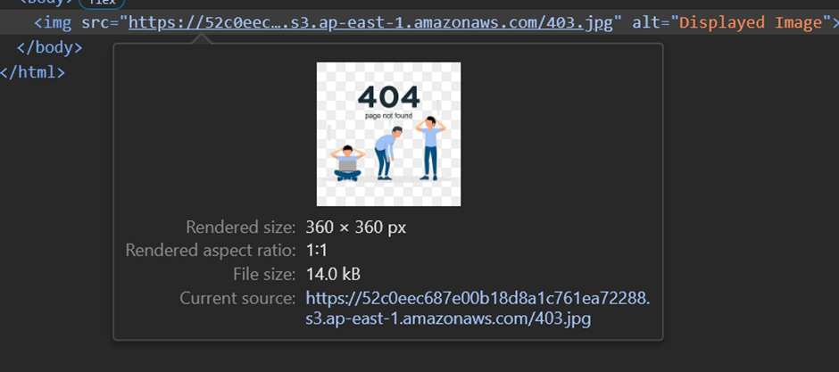
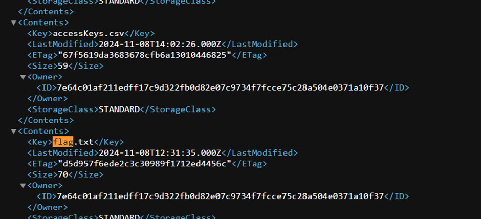
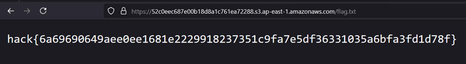

# Cloud 1 - Finding AWS Endpoint

## Challenge Information
- **Name**: Cloud 1 - Finding AWS Endpoint
- **Points**: 50
- **Category**: Cloud
- **Objective**: Discover the AWS endpoint associated with the challenge and retrieve the flag.

## Solution

1. **Initial Exploration**:
   - Started by viewing the source code of the entry page (CTRL+U) in search of any AWS-related links or references.
   - No relevant links were found.

   

2. **Brute Forcing Directories**:
   - Attempted directory enumeration using `feroxbuster` to discover hidden paths but abandoned this method midway, recalling this was primarily an AWS-focused challenge.

3. **Identifying Login Page**:
   - Realized the presence of a `login.html` page, which led to further exploration.


   

4. **Discovering AWS Endpoint**:
   - Within the `login.html` page, noticed a 404 error image that contained the AWS endpoint in its metadata.

5. **Retrieving the Flag**:
   - After obtaining the AWS endpoint, used the AWS CLI or a GUI tool to interact with the endpoint and extract the flag.


   


   

## Commands (if using CLI):
```bash
# Viewing files in s3 bucket
aws s3 ls s3://<s3 bucket> --profile <aws profile>

# Viewing the contents of file without downloading it
aws s3 cp s3://<s3 bucket> - --profile <aws profile>

# Downloading the file
aws s3 cp s3://<s3 bucekt> flag.txt –profile <aws profile>
```
