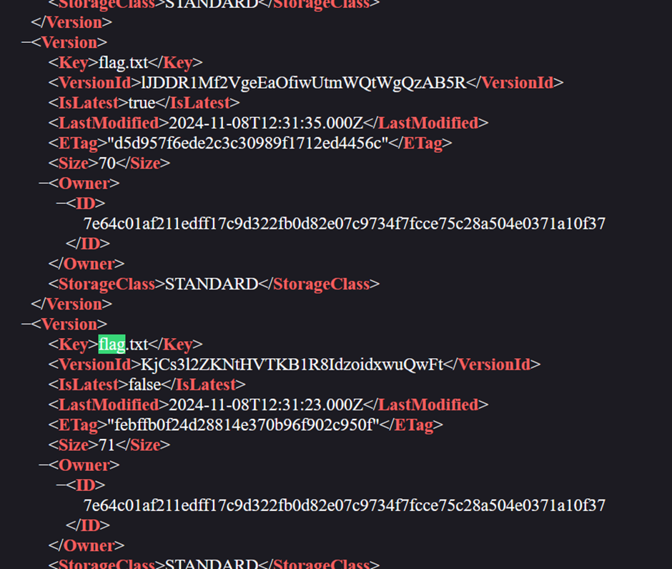
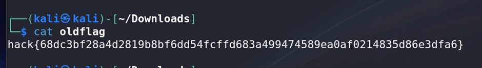

# Cloud 2 - Time Travel

## Challenge Information
- **Name**: Cloud 2 - Time Travel
- **Points**: 100
- **Category**: Cloud
- **Objective**: Retrieve an older version of a file (`flag.txt`) stored in an AWS S3 bucket.

## Solution

### GUI Approach
1. Append `/?versions` to the challenge-provided URL to access the versioning view of the S3 bucket.
   - Example: `http://<bucket-url>/?versions`
2. Observe two versions of `flag.txt`:
   - One is **70 KB**, and the other is **71 KB**.

   

3. As far as I know, GUI does not support direct access to older versions of the file
4. Hence, CLI is required to proceed
5. But I might be wrong

### CLI Approach
1. **Check S3 Bucket Versioning**: Use the following command to confirm bucket versioning and list available versions
    ```bash
    aws s3api get-bucket-versioning --bucket <s3-bucket-name>
    ```
2. **List Object Versions**: Retrieve all versions of flag.txt with
    ```bash
    aws s3api list-object-versions --bucket <s3-bucket-name> --prefix "flag.txt"
    ```
3. **Retrieve the Old File**: Use the specific VersionId for the older version (e.g., KjCs3l2ZKNtHVTKB1R8IdzoidxwuQwFt) to download the file
    ```bash
    aws s3api get-object --bucket <bucket>\
                     --key "flag.txt" \
                     --version-id "KjCs3l2ZKNtHVTKB1R8IdzoidxwuQwFt" \
                     oldflag --profile ccx
    ```

   