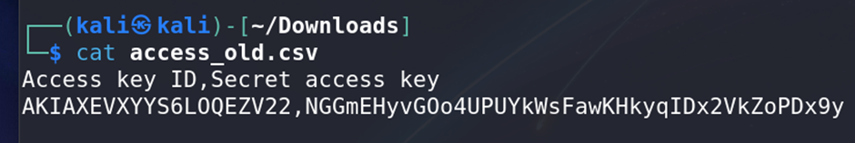
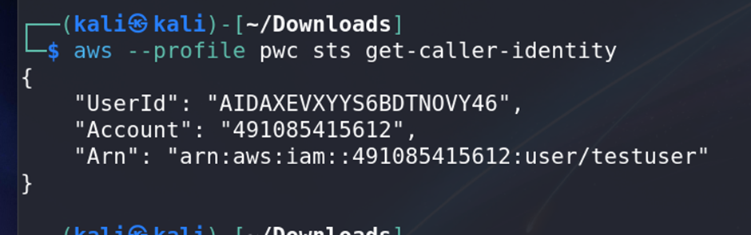
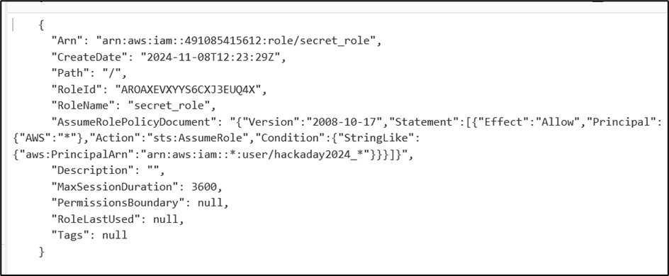
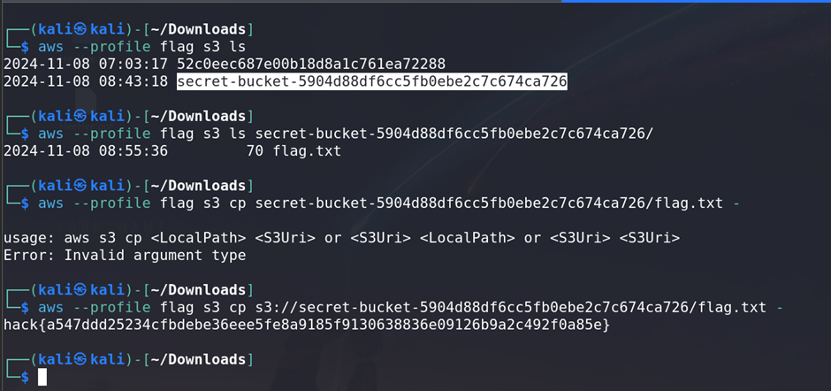

# Cloud 3 - Role Hijacking

## Challenge Information
- **Name**: Cloud 3 - Role Hijacking
- **Points**: 150
- **Category**: Cloud
- **Objective**: Use role hijacking techniques to escalate privileges and retrieve the flag.

## Solution

1. **Accessing the Test User**:
   - Using the method earlier to access older version of files, you should already know that you will be needing the old `accessKeys.csv`
   - The old `accessKeys.csv` file contains credentials for the `testuser`.
   - Used these keys to log in to the AWS account.


   

   

2. **Enumerating Permissions**:
   - **Manual Enumeration**:
     - Doing some basic enumeration, it indicated that `testuser` had limited permissions, leading to a dead end.
   - **Automated Tools**:
     - But I still used **PMapper** and **CloudFox** for more in-depth enumeration just in case I missed some
       - **PMapper**:
         - Builds a permissions graph similar to BloodHound but for AWS accounts.
         - Identified no direct escalation paths or relationships for `testuser`.
       - **CloudFox**:
         - Automated enumeration of potential AWS vulnerabilities and permissions.
         - Revealed a **`secret_reader` role**, capable of reading AWS contents.

3. **Role Hijacking**:
   - The `secret_reader` role permissions indicated a regex check on usernames, allowing anyone with a matching username to assume the role.
   - Created a new username in the account's Cognito (or relevant IAM platform) profile to match the regex.


   

   - You can definitely create a user that matches the regex using GUI, but I prefer to use CLI 
   - The commands I used are:

     ```bash
      # Creating a user with matching regex
      aws iam create-user --user-name hackaday2024_Malaysia_Chai_Cheng_Xun --profile ccx

      # Creating access keys for this user
      aws iam create-access-key --user-name hackaday2024_Malaysia_Chai_Cheng_Xun –profile ccx

      # Attaching full IAM policy to this user just in case
      aws iam attach-user-policy --user-name hackaday2024_Malaysia_Chai_Cheng_Xun --policy-arn arn:aws:iam::aws:policy/IAMFullAccess --profile ccx

      # Attaching sts:assumeRole so that this user can assume a role. I made sure that this user can only assume the challenge role
      aws iam put-user-policy --user-name hackaday2024_Malaysia_Chai_Cheng_Xun --policy-name AllowAssumeSecretRole --policy-document '{ "Version": "2012-10-17", "Statement": [ { "Effect": "Allow", "Action": "sts:AssumeRole", "Resource": "arn:aws:iam::491085415612:role/secret_role" } ] }' --profile ccx
     ```


4. **Assuming the Role**:
   - Used the new username and applied the following command to assume the `secret_reader` role:
   - 
     ```bash
     aws sts assume-role --role-arn arn:aws:iam::491085415612:role/secret_role --role-session-name hackaday --profile hijack
     ```
   - Received new **Access Key** and **Secret Access Key** for the `secret_reader` role.

5. **Retrieving the Flag**:
   - With elevated permissions, accessed the resources tied to the `secret_reader` role and retrieved the flag.


   
