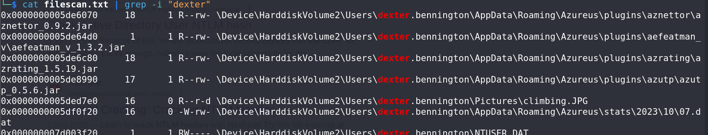

# Unearth the Long Lost Cipher - CTF Challenge Writeup

Challenge: Unearth the Long Lost Cipher  
Points: 150  
Category: Memory Forensics  

## Objective
The objective of the "Unearth the Long Lost Cipher" challenge is to conduct memory forensics to find Dexter's password on a computer. Your task is to identify the password and reveal the hidden flag.

## Solution
To successfully complete the "Unearth the Long Lost Cipher" challenge, follow these steps:

1. **Prerequisite - Complete m3m0irs**:
   - This challenge is the second in the memory forensics series and assumes you have completed the "m3m0irs" challenge. However, since the previous challenge has ended, it's not necessary to have completed it to proceed.

2. **Password Search**:
   - You are tasked with finding Dexter's password on the computer. Passwords can be located in various ways during memory forensics, such as examining hash dumps or LSA dumps.

3. **Hash Cracking Attempt**:
   - An initial approach might involve attempting to crack the password hashes, but it didn't yield results in this case.

4. **File Scan and Grep**:
   - Another approach is to scan the memory for files and grep for references to "Dexter." You can perform file scans using the command: `volatility -f <memory file> --profile=<architecture> filescan > filescan.txt`.

5. **Locate SECRET.txt File**:
   - During the file scan, you may discover a file named "SECRET.txt." Extract this file from the memory dump using the command: `volatility -f <memory file> --profile=<architecture> dumpfiles -Q <memory-location> -D <directory-where-you-wish-to-place-the-file>`.

6. **Examine Dexter's Files**:
   - Investigate the contents of Dexter's files to gather information. You may find hints that lead to the password.

7. **Password Clues**:
   - Dexter constructed his password using his favorite animal and a mysterious "MMYY." Your task is to determine the animal and decode the password using the provided clues.

8. **Flag Format**:
   - The flag will be in the format specified, with the animal represented by 7 letters, followed by "MM" and "YY."

9. **Multiple Panther Instances**:
   - After examining Dexter's files, you may discover two instances of the word "panther." Assume this is his favorite animal and forms the first part of the flag (7 letters).

10. **Password Changing Hint**:
    - SECRET.txt may contain information about password changes. This hints that passwords are updated regularly.

11. **Password Discovery**:
    - To narrow down the possibilities, investigate when the "notepad" application was used. You may find only two dates in the memory dump, so try both as potential password combinations.

12. After following these steps and conducting memory forensics analysis, you will successfully locate Dexter's password and reveal the hidden flag.

## Flag
The flag for this challenge is in the format: `petgrad2023{XXXXXXXXXX}`.

In the "Unearth the Long Lost Cipher" challenge, memory forensics skills are crucial as you explore the computer's memory to discover Dexter's password and unveil the flag. Best of luck!
