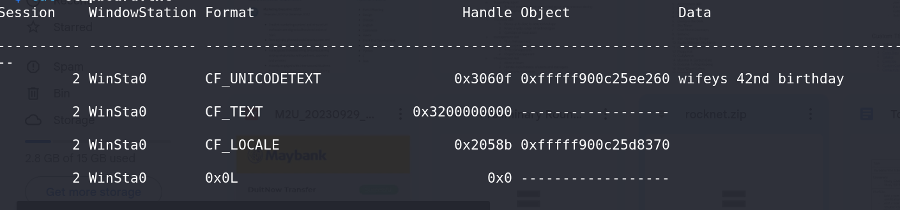

# Unlock the Time Traveller's Dilemma - CTF Challenge Writeup

Challenge: Unlock the Time Traveller's Dilemma  
Points: 200  
Category: Memory Forensics  

## Objective
The objective of the "Unlock the Time Traveller's Dilemma" challenge was to perform advanced memory forensics to find the hidden flag. This challenge was the fourth in the memory forensics series, and while it was recommended to solve the previous three challenges, it wasn't necessary as the CTF had ended.

## Solution
To successfully complete the "Unlock the Time Traveller's Dilemma" challenge, I followed these steps:

1. **File Analysis**:
   - I explored various aspects of the computer's memory, including examining the MFT (Master File Table) using `mftparser` and reviewing the state of the computer using `screenshot`. Unfortunately, none of these methods provided the flag.

2. **Clipboard Examination**:
   - With my previous methods proving unsuccessful, I turned my attention to `clipboard` content. I used the command: `volatility -f <memory file> --profile=<architecture> clipboard` to examine the clipboard contents.

3. **Flag Discovery**:
   - Although the clipboard content didn't immediately resemble the flag, but I tried it anyways and solved the challenge.

4. After conducting a comprehensive memory forensics analysis, I successfully found the flag and completed the challenge.

## Flag
The flag for this challenge is in the format: `petgrad2023{XXXXXXXXXX}`.

In the "Unlock the Time Traveller's Dilemma" challenge, my advanced memory forensics skills were put to the test as I explored various aspects of the computer's memory to unveil the hidden flag. It was a rewarding challenge that required careful analysis. Good luck!
