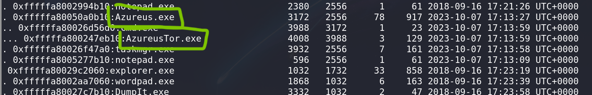

# m3m0irs - CTF Challenge Writeup

Challenge: m3m0irs  
Points: 50  
Category: Memory Forensics  

## Objective
The objective of the m3m0irs challenge is to perform memory forensics on a memory dump file to uncover suspicious activity. Your task is to analyze the memory dump to identify the software that should not be running and reveal the hidden flag.

## Solution
To successfully complete the m3m0irs challenge, follow these steps:

1. **Memory Dump Analysis**:
   - In any memory forensics challenge, the first step is to determine the architecture of the system. You can achieve this using the `volatility` tool with the command: `volatility -f <memory dump> imageinfo`.
   - The `imageinfo` command will provide suggested architectures based on the memory dump's analysis.

2. **Architecture Identification**:
   - Try each of the suggested architectures until you find one that works for your analysis. You can use the following command to specify the architecture: `volatility -f <memory dump> --profile=<architecture>`.

3. **Identifying Suspicious Software**:
   - The main objective is to identify software that shouldn't be running. You can often find this information in the process lists of the memory dump.
   - There are various ways to find processes in a memory dump, such as `pstree`, `pslist`, `psscan` etc. `pstree`" is a favorite among many analysts because it presents processes in a hierarchical manner, allowing you to easily trace parent and child processes.
   - You can identify suspicious software based on the processes and their relationships in the tree.

4. **Analyzing with "pstree"**:
   - Use the following command to generate a `pstree` analysis and save it to a file for reference: `volatility -f <memory dump> --profile=<architecture> pstree > pstree.txt`.
   - Saving the output to a file ensures that you can revisit the analysis without repeating the same steps.

5. **Flag Discovery**:
   - During your analysis, you may find `Azureus` to be suspicious as it spawned `AzureusTor`. This is the software that shouldn't be running.

6. By following these steps and conducting memory forensics analysis, you will uncover the suspicious software and reveal the hidden flag.

## Flag
The flag for this challenge is in the format: `petgrad2023{XXXXXXXXXX}`.

In the m3m0irs challenge, memory forensics skills are put to the test as you analyze a memory dump to identify the suspicious software that shouldn't be running. Best of luck!
