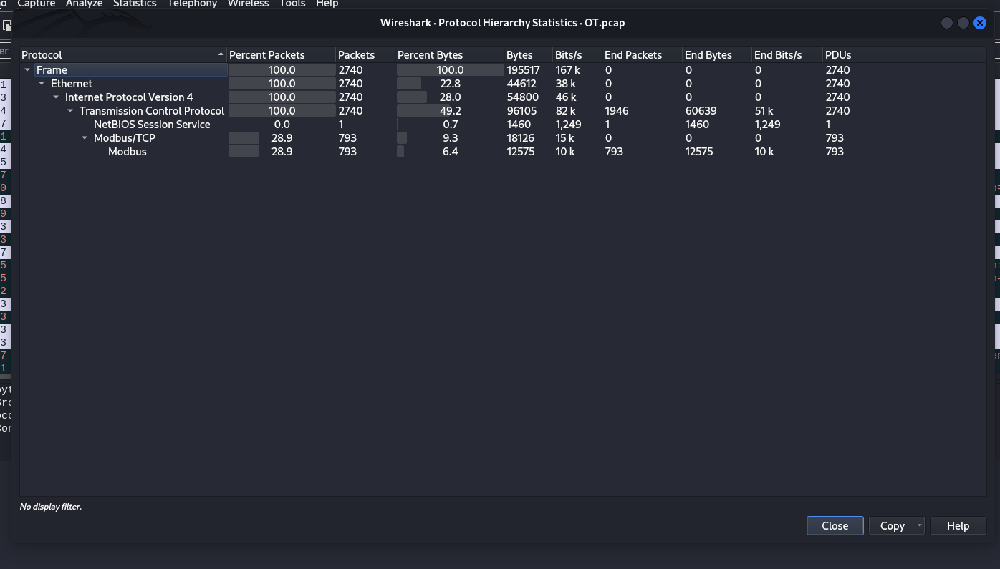

# The Early Quantum Supercomputer I - CTF Challenge Writeup

Challenge: The Early Quantum Supercomputer I  
Points: 100  
Category: Network Forensics, Operational Technology  

## Objective
The objective of "The Early Quantum Supercomputer I" challenge is to analyze a provided pcap file and identify an uncommon protocol to uncover the hidden flag. Your task is to investigate the network traffic and pinpoint the unique protocol.

## Solution
To successfully complete "The Early Quantum Supercomputer I" challenge, follow these steps:

1. **Analyze the PCAP File**:
   - Begin by opening the provided pcap file.

2. **Examine Network Traffic**:
   - Scrutinize the network traffic captured within the pcap file.

3. **Identify Uncommon Protocols**:
   - Pay close attention to the protocols being used. Look for any uncommon or unusual protocols that may stand out.

4. **Flag Identification**:
   - The flag is hidden within the uncommon protocol you identify during your analysis.

5. **Flag Discovery**:
   - As you identify the unique protocol, you will uncover the hidden flag. The flag is the uncommon protocol. 

6. By following these steps and investigating the network traffic within the pcap file, you will successfully reveal the flag.

## Flag
The flag for this challenge is in the format: `petgrad2023{XXXXXXXXXX}`.

In "The Early Quantum Supercomputer I" challenge, your task is to analyze network traffic within a pcap file and identify the uncommon protocol that hides the flag. Best of luck!
