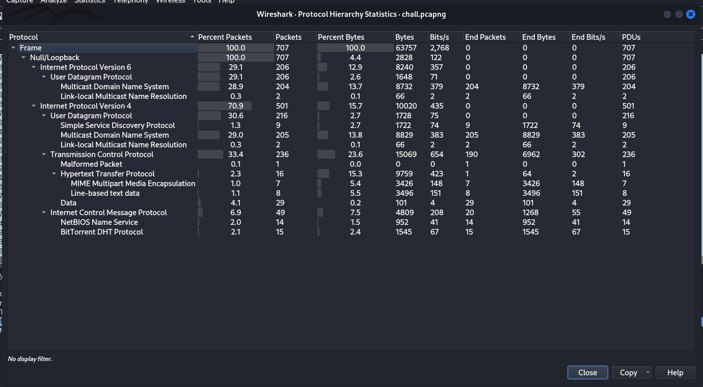

# Temporal Traffic Traces - CTF Challenge Writeup

Challenge: Temporal Traffic Traces  
Points: 100  
Category: Network Forensics  

## Objective
The objective of the "Temporal Traffic Traces" challenge is to analyze a provided pcap file and extract the hidden flag. Your task is to investigate the protocol hierarchy, identify relevant data, and decode the flag.

## Solution
To successfully complete the "Temporal Traffic Traces" challenge, follow these steps:

1. **Analyze the PCAP File**:
   - You are given a pcap file, and the first thing to do is to analyze its contents.

2. **Check Protocol Hierarchy**:
   - Examine the protocol hierarchy within the pcap file. Look for any anomalies or unusual combinations of protocols.

3. **Focus on HTTP Traffic**:
   - In this challenge, it's essential to focus on HTTP traffic. You can identify and extract HTTP packets, which may contain relevant data.

4. **Export HTTP Packets as Files**:
   - Using a tool like Wireshark's export functionality, extract HTTP packets as files for closer inspection.

5. **Identify Base64 Encoding**:
   - During your analysis, you may come across a base64 encoded message within the extracted files.

6. **Decode the Message**:
   - Decode the base64-encoded message to unveil the hidden flag.

7. **Flag Discovery**:
   - As you decode the message, you will discover the flag hidden within the "Temporal Traffic Traces." The flag follows the format: `petgrad2023{XXXXXXXXXX}`.

8. By following these steps and investigating the pcap file's network traffic, you will successfully reveal the flag.

## Flag
The flag for this challenge is in the format: `petgrad2023{XXXXXXXXXX}`.

In the "Temporal Traffic Traces" challenge, your task is to analyze network traffic within a pcap file, extract the relevant data, and decode the hidden flag. Best of luck!
