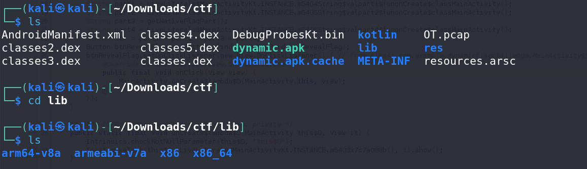

# Getmecorrect - CTF Challenge Writeup

Challenge: Getmecorrect  
Points: 150  
Category: Reverse Engineering  

## Objective
The objective of the "Getmecorrect" challenge is to reverse engineer an APK file to uncover a hidden flag. The flag is divided into four parts, and you need to understand how these parts are constructed. However, a key part of the flag is implemented using native code, which is not available in the APK's source code. Your task is to find a way to retrieve the missing part of the flag.

## Solution
To successfully complete the "Getmecorrect" challenge, follow these steps:

1. **Analyze the APK File**:
   - Start by opening and examining the APK file using tools like jadx-gui. Look for clues that reveal how the flag is constructed.

2. **Flag Part 3 and Native Code**:
   - While analyzing the APK, you will identify that the third part of the flag relies on the `getNativeFlag()` function. However, this function's implementation is missing from the APK's source code, and it is marked as "native."

3. **Understanding Native Code**:
   - The keyword "native" in the function declaration indicates that the function is implemented using native code, often written in a different programming language like C or C++. This means the actual implementation of `getNativeFlagPart` is not available in the provided APK source code.

4. **Reverse Engineering Native Code**:
   - To retrieve the missing part of the flag, you need to reverse engineer the native code. Begin by converting the `dynamic.apk` to `dynamic.zip`, and then unzip the file.

5. **Examine the Lib Folder**:
   - Navigate to the `lib` folder, where you will find different architectures. Choose the one you are most comfortable with. In this case, the `x86` architecture is used for analysis.

1. **Ghidra Analysis**:
   - Within Ghidra, look for a function with a name that resembles the naming convention used throughout `dynamic.apk`. This function will likely contain the missing part of the flag.

2. **Retrieve the Missing Flag Part**:
   - By examining the code in Ghidra, you can identify the third part of the flag. This part is not encrypted or hidden and is directly accessible in the function.

3. **Flag Discovery**:
   - As you combine the parts of the flag revealed during your analysis, you will uncover the complete hidden flag. The flag follows the format: `petgrad2023{XXXXXXXXXX}`.

4. By following these steps, you will successfully reverse engineer the APK and retrieve the missing part of the flag.

## Flag
The flag for this challenge is in the format: `petgrad2023{XXXXXXXXXX}`.

In the "Getmecorrect" challenge, you need to reverse engineer the APK to construct the flag correctly. Understanding native code and reverse engineering are crucial for solving this challenge. Best of luck!
