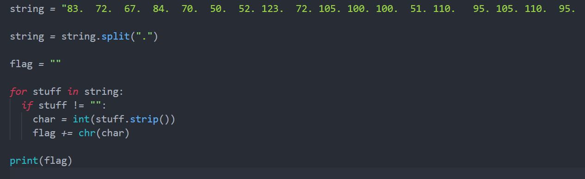

# Deepfake

## Challenge Information
- **Name**: Deepfake  
- **Points**: 100  
- **Category**: AI  
- **Objective**: Analyze the provided `.h5` file to retrieve the flag.  

## Solution  

1. **Initial Investigation**:  
   - The challenge provided a corrupted **HDF5 (.h5)** file
   - Attempts to load the file using deep learning frameworks like TensorFlow or PyTorch failed, as the file structure appeared corrupted

2. **Static Analysis**:  
   - Used **h5py**, a library for inspecting and manipulating HDF5 files, to analyze the file:
     ```python
     import h5py

     with h5py.File("file.h5", "r") as h5file:
         print(h5file.keys())
         for layer in h5file.keys():
             print(layer, h5file[layer][:])
     ```
   - Extracted the number of layers and their corresponding data.

3. **Interpreting the Data**:  
   - The data extracted from the layers did not directly reveal the flag.  
   - Through iterative debugging and suggestions (thanks, ChatGPT!), realized that **rounding the values** in the data to the nearest integers, we found that it appeared to be ASCII values.


      

4. **Flag Recovery**:  
   - After decoding these decimal representations of ASCII, the flag was clearly encoded in the data.


      

## Flag  
- **Flag**: `SHCTF24{Hidd3n_in_Th3_Lay3rs}`  
