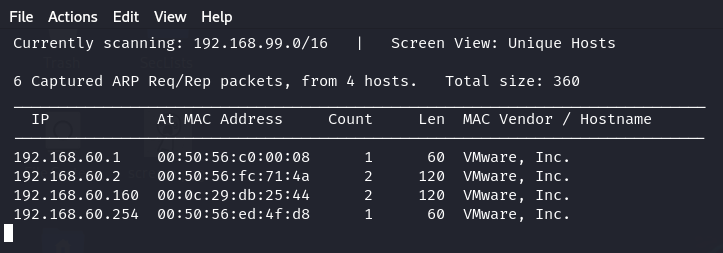
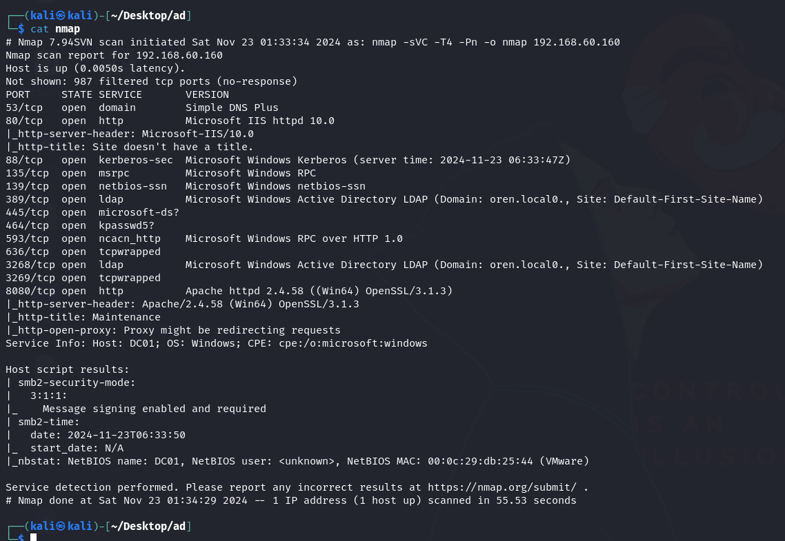
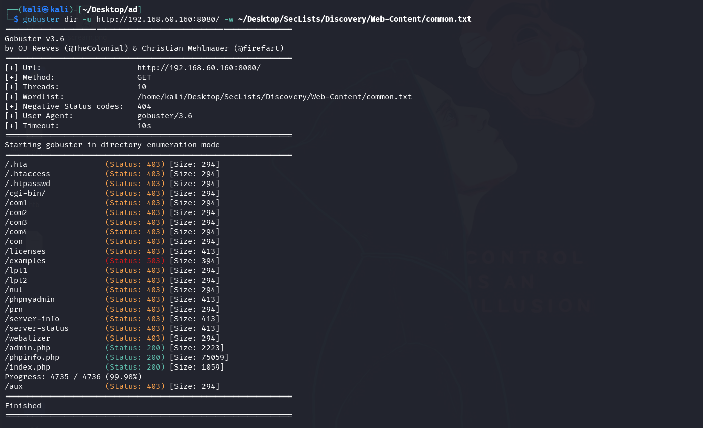
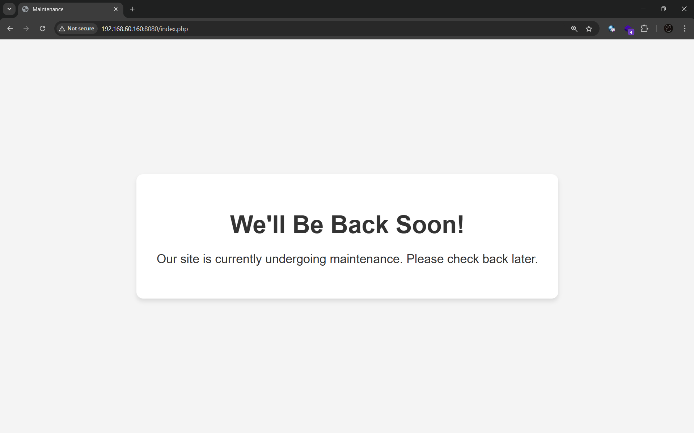
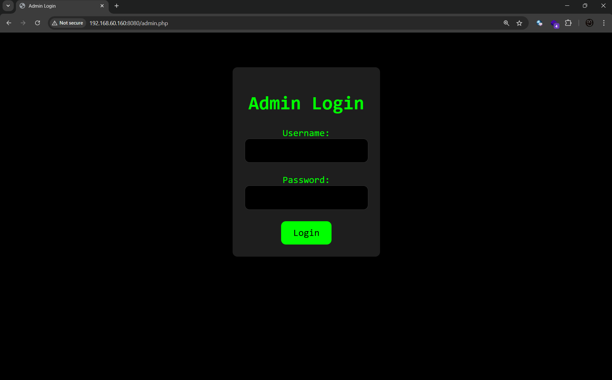
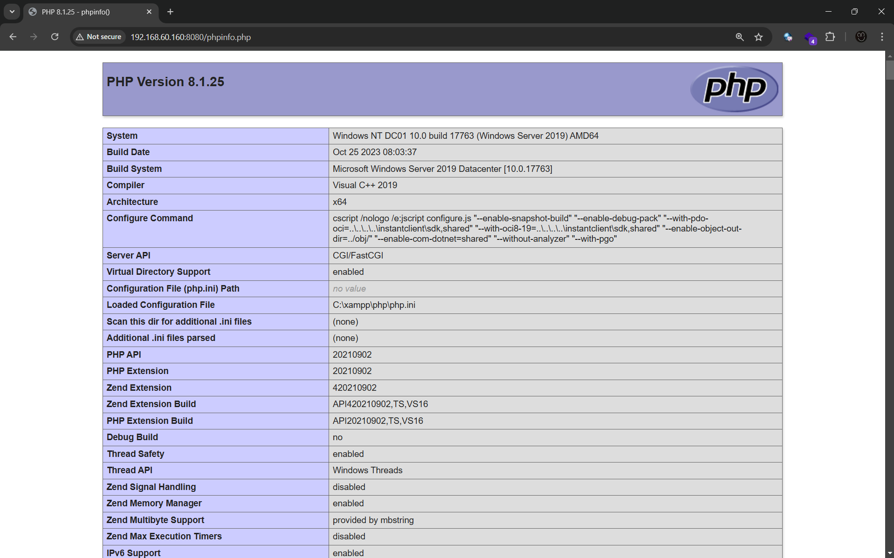
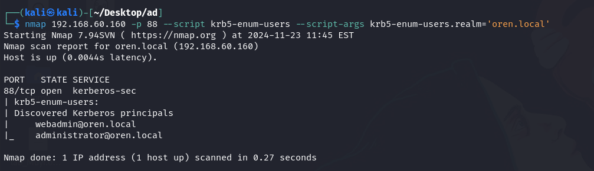
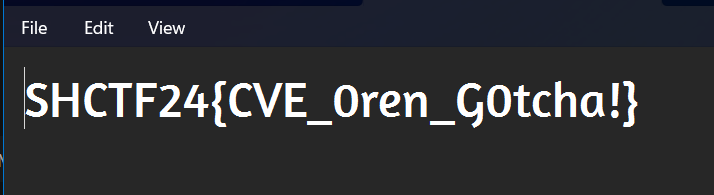

# Oren

## Challenge Information
- **Name**: Oren  
- **Points**: 100  
- **Category**: Boot2Root  
- **Objective**: Exploit the target machine and retrieve the flag.  

## Solution  

1. **Initial Connection**:  
   - Connected the local challenge machine to NAT and used **netdiscover** to identify its IP address.  

      

2. **Enumeration**:  
   - Scanned the machine using **nmap**:  
     - Found that we are attacking a **Windows machine**.

      

   - Explored the web application on port `8080`:
     - Discovered `admin.php`, `phpinfo.php`, and `index.php` using **feroxbuster**.
     - Attempted **SQL injection** on `admin.php` using **sqlmap**, but it failed.

      

       

      
       

      
      

3. **Kerberos Enumeration**:  
   - Re-scanned using **nmap** for potential users.  
   - Found usernames but failed to crack them via password spraying or brute-forcing the login page.

      

4. **Exploit Development**:  
   - Found PHP version `8.1.25` from `phpinfo.php`.
   - Searched for related exploits but none of the existing POCs worked.  
   - The challenge hint suggested focusing on the title **Oren**, which led to discovering an exploit for **PHP 8.1.25 "orange"**.

      

      

5. **Gaining Access**:  
   - Used the **PHP 8.1.25 orange exploit** to gain access as the `webadmin` user.  

6. **Privilege Escalation**:  
   - Enumerated the box and discovered files related to the flag.  
   - Found a **PowerShell script** that, when executed, revealed the password for `user.zip`.  
   - Unzipped the archive to retrieve the flag.

      

      

      

      

## Flag  
- **Flag**: `SHCTF24{XXXXXXXXXX}`  
