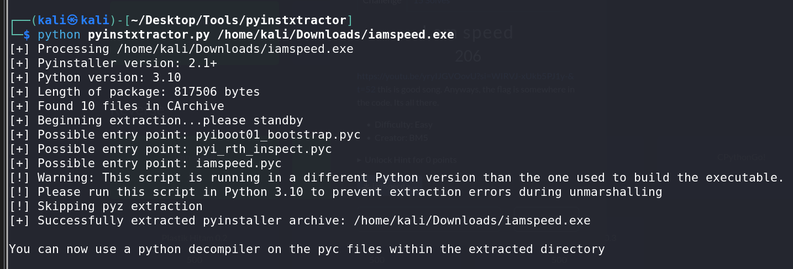
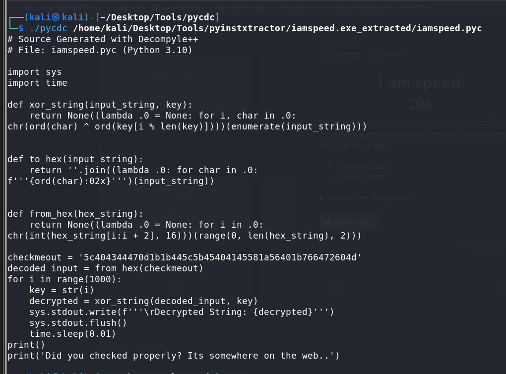
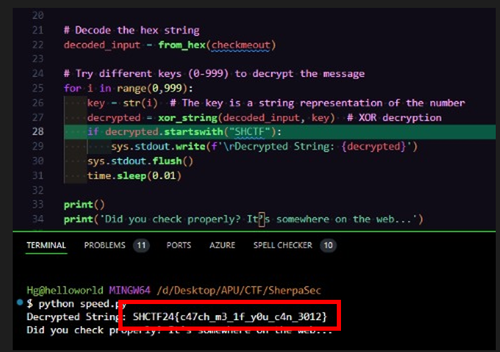

# iamspeed

## Challenge Information
- **Name**: iamspeed  
- **Points**: 100  
- **Category**: Reverse  
- **Objective**: Analyze the Python-compiled executable to retrieve and decode the flag.  

## Solution  

1. **Initial Enumeration**:  
   - Upon inspecting the executable, it was identified as a **Python-compiled executable** based on the presence of Python-related artifacts.  

      

2. **Decompiling the Executable**:  
   - **Tools Used**:  
     - **PyInstaller Extractor** (`pyinstxtractor`) to extract the `.pyc` file.  
     - **PyCDC** to decompile the `.pyc` file into readable Python source code.  

      

     

3. **Analyzing the Decompiled Script**:  
   - My teammate, **Nem4ros** then ran the script and found hints of **hidden HTTPS link**.  
   - He then modified the script to print the extracted link directly.  

      

      

4. **Accessing the Link**:  
   - The link pointed to a Google document containing **encoded text**.  

      

5. **Decoding the Text**:  
   - Attempts to decode the text with standard methods like **hex decoding** failed.  
   - The text was successfully decoded using the **original script** to process the encoded data.  

      

## Flag  
- **Flag**: `SHCTF24{XXXXXXXXXX}`  
