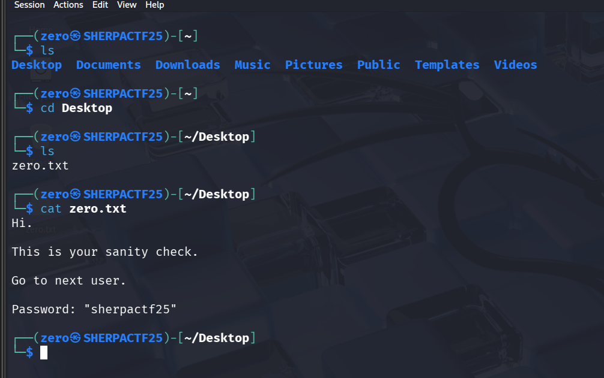

# Zero - CTF Challenge Writeup

## Challenge Information
- **Name**: Zero  
- **Points**: 10  
- **Category**: Misc  
- **Objective**: Locate and extract the flag by investigating a provided file or image (`zero:welcome`). The goal is to navigate the user profile and identify credentials or indicators of compromise from accessible paths.

---

## Solution

### 1. **Navigating to the Desktop**
- given `zero:welcome`, proceed to Desktop folder to find the password for User One.

    

---

## Flag
The flag for this challenge is:  
`sherpactf25`