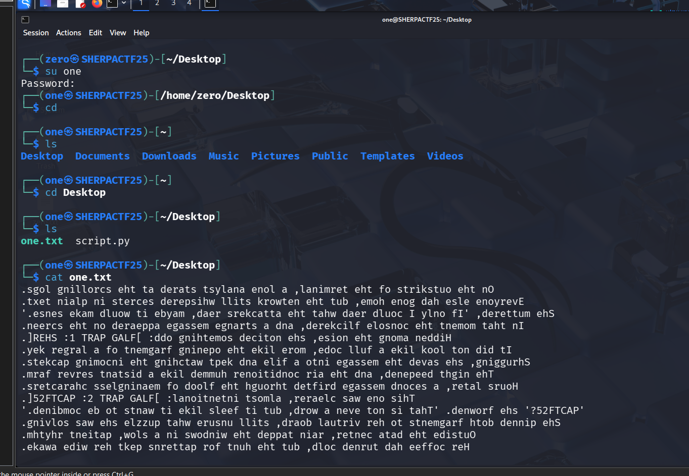

# One - CTF Challenge Writeup

## Challenge Information
- **Name**: One  
- **Points**: 10  
- **Category**: Misc  
- **Objective**: Identify and decode a simple obfuscated message left by a previous user.

---

## Solution

- From **User Zero**, we find a file with a ciphered message.
- The message appears to be **reversed text**.
- Wrote a quick Python script to reverse it:

```python
with open('one.txt', 'r') as file:
    data = file.read()[::-1]
    print(data)
```




## Flag
The flag for this challenge is:  
`SHERPACTF25{I_Kn3w_it_44}`