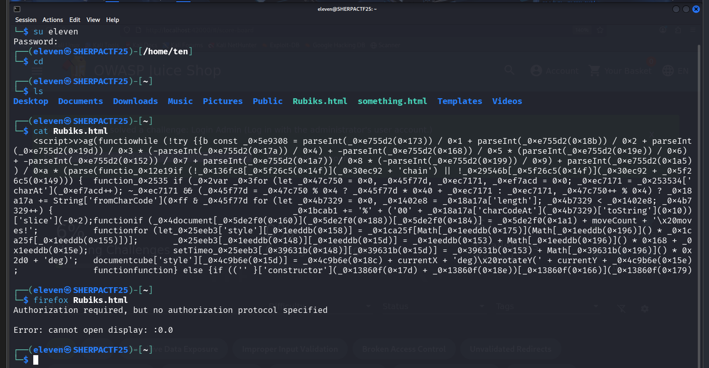

# Eleven - CTF Challenge Writeup

## Challenge Information
- **Name**: Eleven  
- **Category**: Misc  
- **Points**: 10  
- **Objective**: Access and manipulate a custom Rubik’s Cube web challenge under restricted user sessions to retrieve the flag.

---

## Solution

- From **User Ten**, we’re given a **custom web challenge**.

    

- At first, I couldn’t open the `Rubiks.html` file due to **permission issues**.
- After **45 minutes of debugging**, I realized I had been `su`-ing through multiple users — causing nested shells under **User Zero’s terminal**.
- Because of that, although I was technically **User Ten**, the permission context was messed up.
- To fix this, I **logged out completely** and logged in directly as **User Ten**. That allowed me to open **Firefox** and view the HTML page.

    

- The challenge was a **Rubik’s Cube simulation**. As someone who can solve a cube physically, I considered solving it directly.
  - But the page didn’t allow turning multiple layers, and I couldn’t mentally map 1-layer operations.
  - So instead, I chose the **easier way**: modifying the **source code** to force the check function to always **return true**.

    

- This trick worked — and the flag was revealed.

    

---

## Flag  
`RUBIKSCUBEMASTA`
