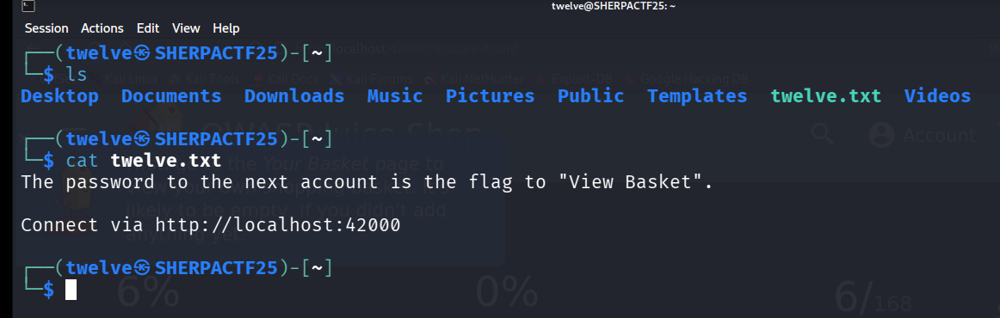
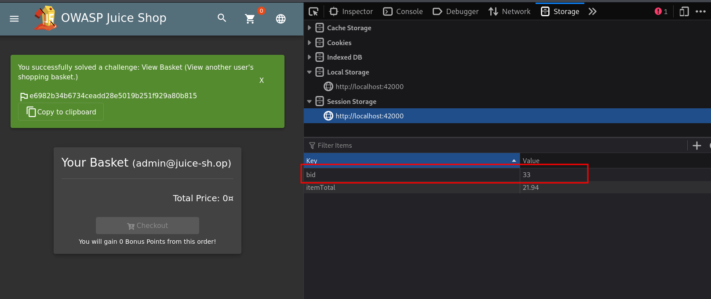

# Twelve - CTF Challenge Writeup

## Challenge Information
- **Name**: Twelve  
- **Category**: Misc  
- **Points**: 10  
- **Objective**: Exploit session manipulation in OWASP Juice Shop to gain access to another user's basket and retrieve the flag.

---

## Solution

- From **User Eleven**, we’re handed yet another **OWASP Juice Shop** challenge.

    

- This one revolves around accessing **another user's basket** — a classic session-based vulnerability.
- The key here is that the **basket ID is stored in `sessionStorage`**, which is accessible via the browser's developer tools.
- By manually modifying the `bid` value in `sessionStorage`, we can point our session to a different user’s basket.
- After trying a few IDs, one of them **revealed the flag** tied to that other user's data.

    

---

## Flag  
`e6982b34b6734ceadd28e5019b251f929a80b815`
