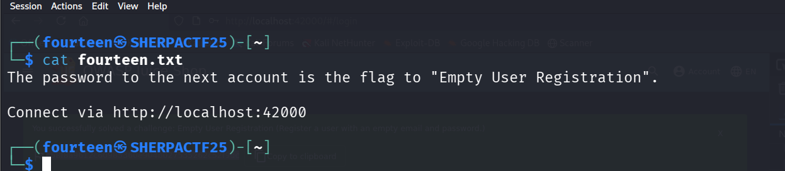

# Fourteen - CTF Challenge Writeup

## Challenge Information
- **Name**: Fourteen  
- **Category**: Misc  
- **Points**: 10  
- **Objective**: Exploit OWASP Juice Shop by registering a user with empty input values to trigger a vulnerable behavior and obtain the flag.

---

## Solution

- From **User Thirteen**, we’re given **another OWASP Juice Shop** challenge.

    

- The goal here is to **register a user with empty fields** — which the frontend normally doesn’t allow.
- Using **Firefox’s built-in repeater** or dev tools, we can intercept the registration request and **manually edit the payload** to submit empty values (e.g., empty email and password).

    

    

- The backend fails to validate it properly, resulting in successful registration and exposure of the **flag**.

    

---

## Flag  
`e58f8a9612c60985360e904b027535262c52f9dc`
