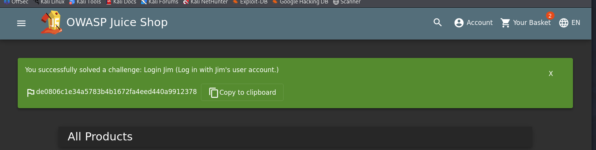

# Eighteen - CTF Challenge Writeup

## Challenge Information
- **Name**: Eighteen  
- **Category**: Misc  
- **Points**: 10  
- **Objective**: Log in as a specific user (Jim) in OWASP Juice Shop using SQL Injection to retrieve the flag.

---

## Solution

- From **User Seventeen**, we’re given another **OWASP Juice Shop** challenge. This time, the task is to **log in as Jim**.

    

- Actually, we had already done something similar earlier when logging in as admin to delete five-star ratings.
- The first step is to **find Jim's email**, which is typically:`jim@juice-sh.op`

    

- Then, use a **basic SQL injection** payload to bypass the password check: `jim@juice-sh.op'--`
- This logs us in as Jim, and once authenticated, the **flag becomes accessible** — either via the profile page or shown directly.

    

---

## Flag  
`de0806c1e34a5783b4b1672fa4eed440a9912378`
