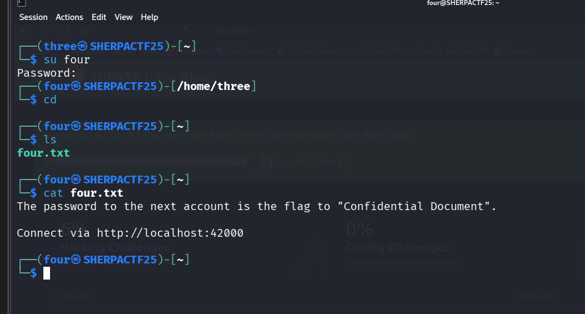
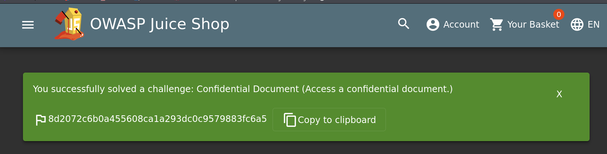

# Four - CTF Challenge Writeup

## Challenge Information
- **Name**: Four  
- **Category**: Misc  
- **Points**: 10  
- **Objective**: Access and explore an exposed FTP server tied to an OWASP Juice Shop challenge to retrieve confidential internal files, including the flag.

---

## Solution

- From **User Three**, we’re given another **OWASP Juice Shop**-related challenge.

    

- This time, the focus is on an **open FTP server** that contains internal files.
- Browsing through the FTP, one of the files available is `acquisitions.md`.
- Opening that file reveals the **flag directly**.

    

---

## Flag
`8d2072c6b0a455608ca1a293dc0c9579883fc6a5`
