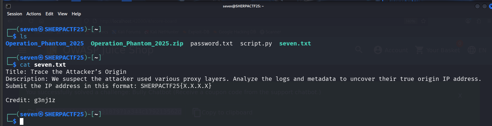

# Seven - CTF Challenge Writeup

## Challenge Information
- **Name**: Seven  
- **Category**: Misc  
- **Points**: 10  
- **Objective**: Identify the real IP address of the attacker from the data provided by User Six.

---

## Solution

- From **User Six**, the task was to determine the **real IP address** of the attacker.

    

- I went with a **brute-force approach**, submitting all possible IPs found in the provided logs/data.
- Eventually, one of them returned a **positive result**.

    

- One important note: the flag format had a quirk — the platform **expected the flag without the '5'** in `SHERPACTF25`.
- So instead of `SHERPACTF25{...}`, the correct format was **`SHERPACTF2{...}`**.

---

## Flag  
`SHERPACTF2{103.17.24.77}`
