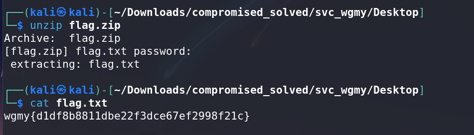

# Compromised - CTF Challenge Writeup

## Challenge Information
- **Name**: Compromised
- **Category**: Forensics
- **Objective**: The objective of the "Compromised" CTF challenge is to extract a hidden flag embedded within a complex set of files and directories.

## Solution
To successfully solve the "Compromised" challenge, I executed the following steps:

1. **Initial Examination**:
   - Unzipped the provided challenge file, revealing a directory structure reminiscent of a Windows directory.

2. **Flag Identification**:
   - Using the `tree` command, I quickly located the flag within the directory structure. However, it was a zip file itself, requiring further steps for extraction.

        

        

3. **Brute Forcing the Zip File**:
   - Attempted to brute force the password for the zip file. Initially faced permission issues, resolved by changing permissions using `chmod`.
   - Used `John The Ripper` to crack the zip file password, which proved unsuccessful, prompting a search for the password.

        

4. **Locating Password**:
   - After some exploration, identified the crucial file named `Cache0000.bin`, which holds significant data for the challenge.
   - `Cache0000.bin` contains data related to Remote Desktop Protocol (RDP) cache.

        

5. **Extracting Images from Cache File**:
   - Employed the tool `bmc-tools` (https://github.com/ANSSI-FR/bmc-tools) to extract pictures from `Cache0000.bin`.

        

6. **Revealing Flag within Images**:
   - Extracted over 2000 images, one of which combines all the segments of the flag.
   - Noticed segments of the flag within the combined image, visible upon zooming in.

        

7. **Combining Segments into Flag**:
   - Utilized  `RDPCacheStitcher` (https://github.com/BSI-Bund/RdpCacheStitcher/releases/) to assemble the segments as if solving a puzzle.

        

8. **Obtaining Password**:
   - Discovered the password `WGMY_P4ssw0rd_N0t_V3ry_H4rd!!!` while assembling the image segments.

9. **Final Flag Extraction**:
   - Successfully unzipped the flag from the zip file using the obtained password.

        

## Flag
The flag for this challenge is: `wgmy{XXXXXXXXXX}`.

This writeup delineates the process of navigating through a directory, extracting images from a cache file, assembling image segments, and obtaining the hidden flag in the "Compromised" CTF challenge. For any further queries or clarifications, please feel free to ask.
