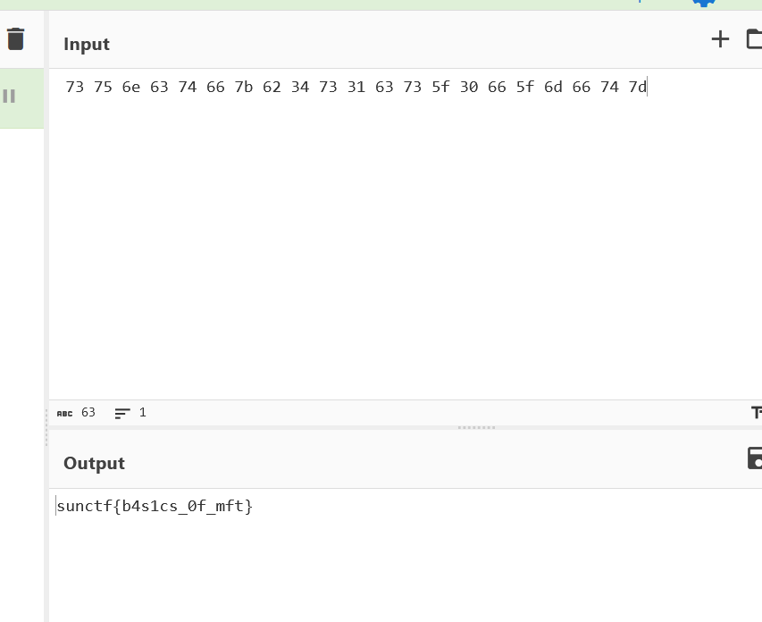

# MasterFanumTax CTF Challenge Writeup

## Challenge Information
- **Name**: MasterFanumTax
- **Points**: 100
- **Category**: Forensics
- **Objective**: Recover and decode the flag from a Master File Table (MFT) file.

## Solution

1. **Understanding MFT**:
   - The **Master File Table (MFT)** is a crucial component of the **NTFS** file system. It stores metadata about every file and directory on the system, including attributes such as file name, size, creation/modification timestamps, and file content location on the disk. By analyzing the MFT, forensic analysts can reconstruct file activities, including deleted files and hidden data.

2. **Parsing the MFT**:
   - I used **Eric Zimmerman's MFTECmd** tool to parse the provided MFT file. This tool is excellent for extracting file names, timestamps, and other metadata from MFT entries.
   - MFTECmd revealed the existence of a file named `flag.txt`, which likely contained the flag. However, I was unable to retrieve the actual contents of this file using this tool alone.

3. **Extracting File Contents**:
   - To retrieve the content of `flag.txt`, I switched to **MFTExplorer**, another tool by Eric Zimmerman. MFTExplorer allowed me to explore the contents of the MFT in greater detail and successfully retrieve the encoded data from the file.

      

4. **Decoding the Flag**:
   - The retrieved flag was encoded. I decoded the encoded flag into plaintext, which revealed the correct flag for submission.

      