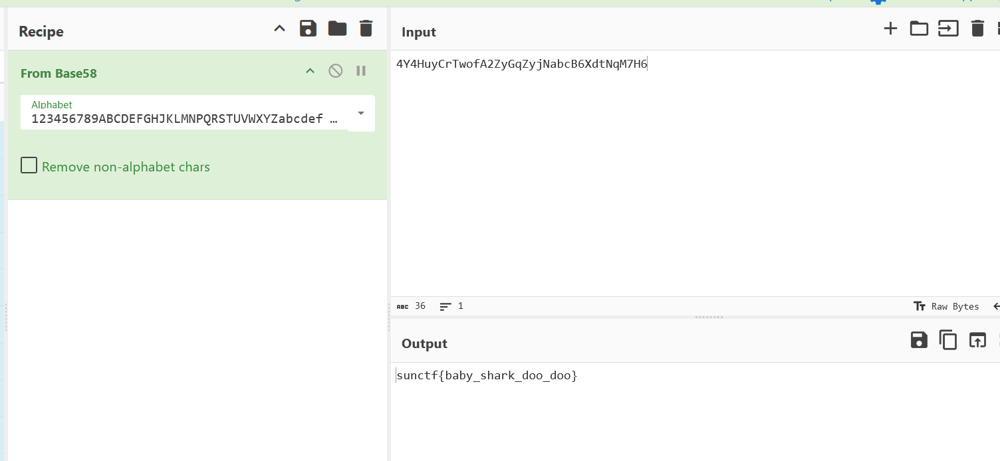

# Baby Shark CTF Challenge Writeup

## Challenge Information
- **Name**: Baby Shark
- **Points**: 100
- **Category**: Forensics
- **Objective**: Analyze a pcap file to find and decode a hidden flag.

## Solution
To solve the "Baby Shark" challenge, follow these steps:

1. **Open the pcap File**:
   - Open the provided pcap file using Wireshark, a tool commonly used for analyzing network traffic captures.

2. **Examine the Protocol Hierarchy**:
   - Before diving into the packet details, check the protocol hierarchy in Wireshark to get a general overview of the captured traffic.

      

3. **Filter for HTTP Traffic**:
   - Since HTTP traffic is typically straightforward to analyze, apply an HTTP filter in Wireshark to isolate it from other protocols.

      

4. **Identify the Suspicious HTTP Request**:
   - Upon inspecting the HTTP traffic, you will notice a path that appears to be base64 encoded.
   - This encoded string is likely the key to retrieving the flag.

5. **Decode the Seemingly Base64 String**:
   - Copy the seemingly base64 encoded string and paste it into CyberChef
   - Use the "Magic" operation in CyberChef to decode the string, it turns out to be base58

6. **Retrieve the Flag**:
   - The decoded string reveals the flag for the challenge.

      

